# SheepOp LLM - Complete Architecture Documentation

Complete documentation of the SheepOp Language Model project architecture, data flow, training pipeline, and inference system.

## Table of Contents

1. [System Overview](#system-overview)
2. [Data Ingestion Pipeline](#data-ingestion-pipeline)
3. [Training Pipeline](#training-pipeline)
4. [Model Architecture](#model-architecture)
5. [Inference Pipeline](#inference-pipeline)
6. [Complete Workflow](#complete-workflow)

---

## System Overview

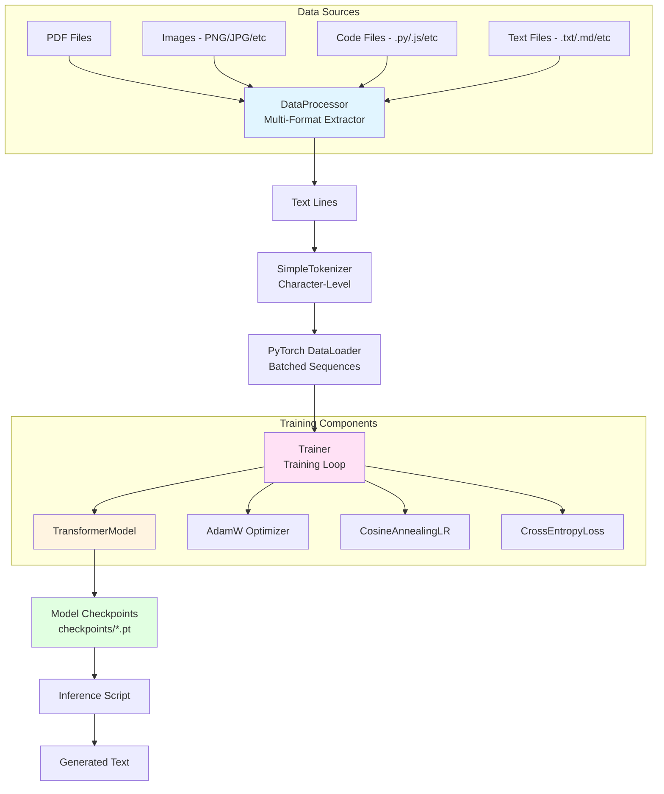

---

## Data Ingestion Pipeline

### Multi-Format Data Processing Flow

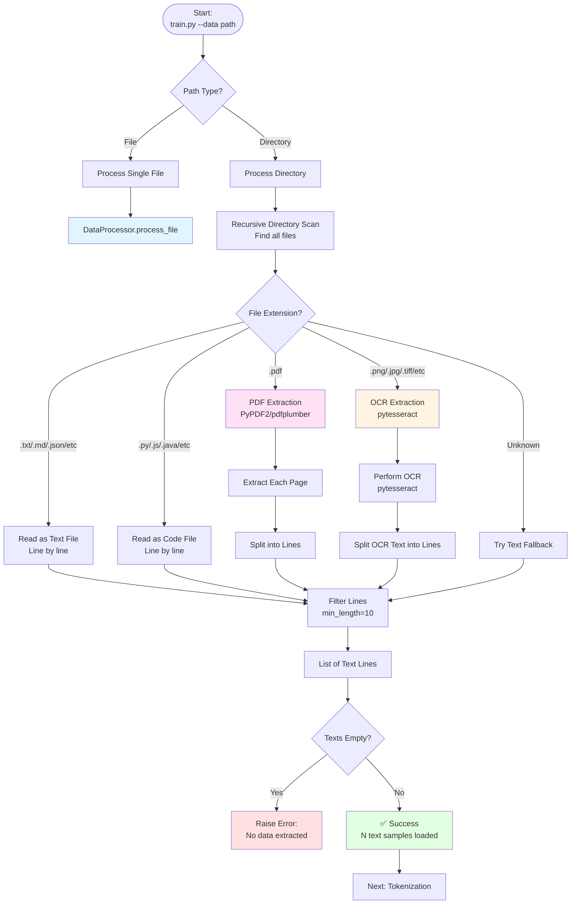

### Data Processing Components

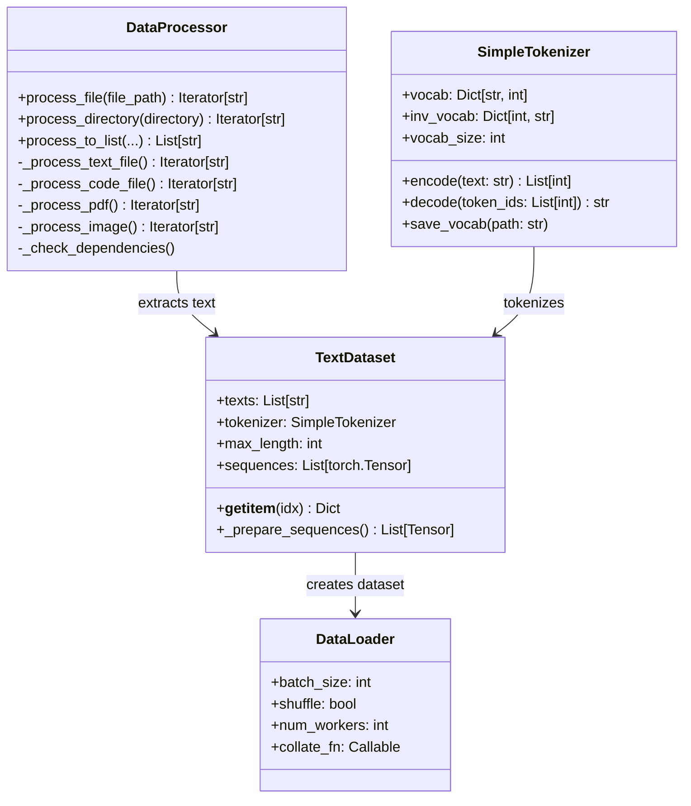

---

## Training Pipeline

### Complete Training Flow

```mermaid
flowchart TD
    Start([python train.py<br/>--data path]) --> Args[Parse Arguments<br/>--data, --config, --resume, --device]
    
    Args --> ConfigLoad{Config File<br/>Provided?}
    ConfigLoad -->|Yes| LoadConfig[Load config.json]
    ConfigLoad -->|No| DefaultConfig[Use Default Config]
    
    LoadConfig --> Config[Config Object<br/>ModelConfig<br/>TrainingConfig<br/>DataConfig<br/>seed=42]
    DefaultConfig --> Config
    
    Config --> SetSeed[Set Random Seed<br/>torch.manual_seed<br/>torch.cuda.manual_seed_all<br/>CUDNN deterministic]
    
    SetSeed --> Device[Detect Device<br/>CUDA/MPS/CPU]
    
    Device --> DataIngestion[Data Ingestion Pipeline<br/>Extract text from all files]
    
    DataIngestion --> TextList[List of Text Lines<br/>N samples]
    
    TextList --> CreateTokenizer[Create SimpleTokenizer<br/>Character-level vocab]
    
    CreateTokenizer --> Tokenizer[Tokenizer Ready<br/>vocab_size calculated]
    
    Tokenizer --> CreateDataLoader[Create DataLoader<br/>Batch size<br/>Max length<br/>Shuffle]
    
    CreateDataLoader --> TrainLoader[PyTorch DataLoader<br/>Batched sequences]
    
    TrainLoader --> CheckResume{Resume<br/>Checkpoint?}
    
    CheckResume -->|Yes| LoadCheckpoint[Load Checkpoint<br/>Model state<br/>Optimizer state<br/>Scheduler state<br/>Epoch/Step]
    CheckResume -->|No| CreateModel[Create New Model<br/>TransformerModel]
    
    LoadCheckpoint --> CreateModel
    
    CreateModel --> Model[Model Ready<br/>N parameters]
    
    Model --> CreateOptimizer[Create Optimizer<br/>AdamW<br/>lr, weight_decay]
    
    CreateOptimizer --> CreateScheduler[Create Scheduler<br/>CosineAnnealingLR<br/>T_max=total_steps]
    
    CreateScheduler --> CreateTrainer[Create Trainer<br/>Model<br/>DataLoader<br/>Optimizer<br/>Scheduler<br/>Device]
    
    CreateTrainer --> Trainer[Trainer Ready]
    
    Trainer --> TrainingLoop[Training Loop<br/>For each epoch]
    
    TrainingLoop --> EpochLoop[For each batch]
    
    EpochLoop --> Forward[Forward Pass<br/>Model prediction]
    
    Forward --> Loss[Compute Loss<br/>CrossEntropyLoss]
    
    Loss --> Backward[Backward Pass<br/>Compute gradients]
    
    Backward --> GradientAccum{Gradient<br/>Accumulation?}
    
    GradientAccum -->|Not yet| Accumulate[Accumulate gradients]
    Accumulate --> EpochLoop
    
    GradientAccum -->|Ready| ClipGrad[Gradient Clipping<br/>max_grad_norm]
    
    ClipGrad --> Update[Update Weights<br/>Optimizer.step]
    
    Update --> UpdateLR[Update Learning Rate<br/>Scheduler.step]
    
    UpdateLR --> ZeroGrad[Zero Gradients]
    
    ZeroGrad --> Log{Log Interval?}
    
    Log -->|Yes| LogMetrics[Log Metrics<br/>Loss, LR<br/>Save to metrics.json]
    Log -->|No| EvalCheck{Evaluation<br/>Interval?}
    
    LogMetrics --> EvalCheck
    
    EvalCheck -->|Yes| Evaluate[Evaluate on<br/>Validation Set]
    EvalCheck -->|No| SaveCheck{End of<br/>Epoch?}
    
    Evaluate --> SaveCheck
    
    SaveCheck -->|No| EpochLoop
    SaveCheck -->|Yes| SaveCheckpoint[Save Checkpoint<br/>Model state<br/>Optimizer state<br/>Scheduler state<br/>Epoch/Step]
    
    SaveCheckpoint --> MoreEpochs{More<br/>Epochs?}
    
    MoreEpochs -->|Yes| TrainingLoop
    MoreEpochs -->|No| GeneratePlots[Generate Training Plots<br/>loss_by_epoch.png<br/>training_curve.png]
    
    GeneratePlots --> End([Training Complete!<br/>Checkpoints saved])
    
    style SetSeed fill:#ffe1f5
    style DataIngestion fill:#e1f5ff
    style Model fill:#fff4e1
    style TrainingLoop fill:#ffe1f5
    style End fill:#e1ffe1
```

### Seed Initialization Details

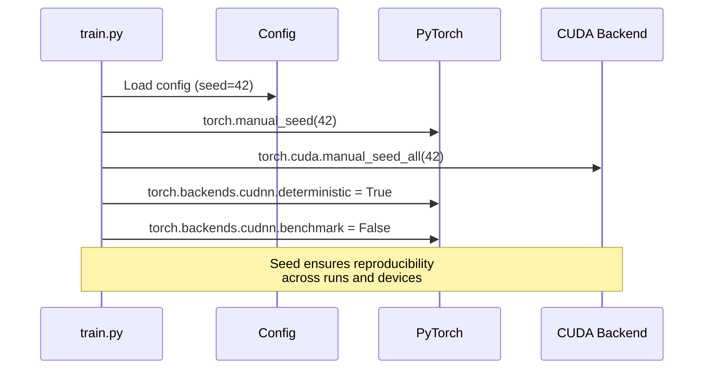

### Training Loop Details

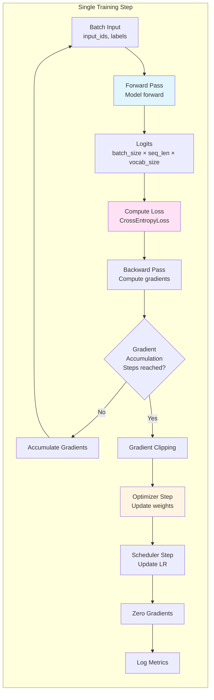

---

## Model Architecture

### Transformer Model Structure

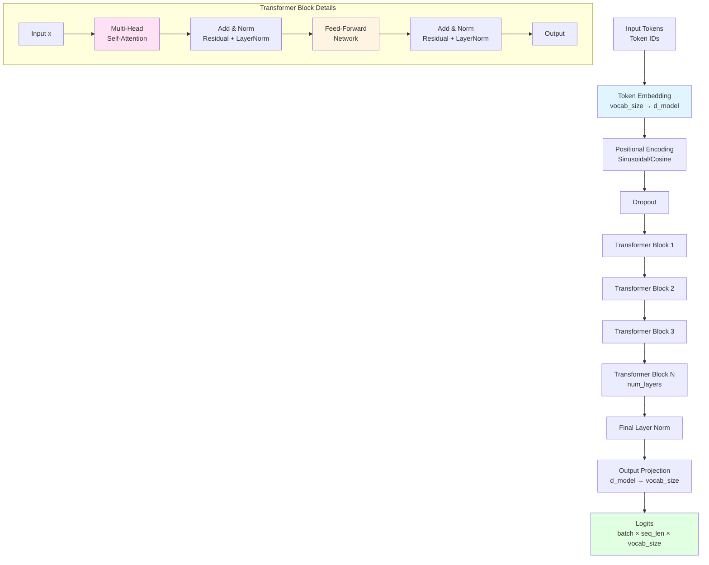

### Multi-Head Attention Mechanism

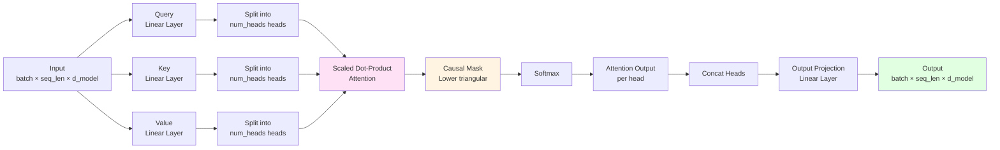

### Complete Model Component Diagram

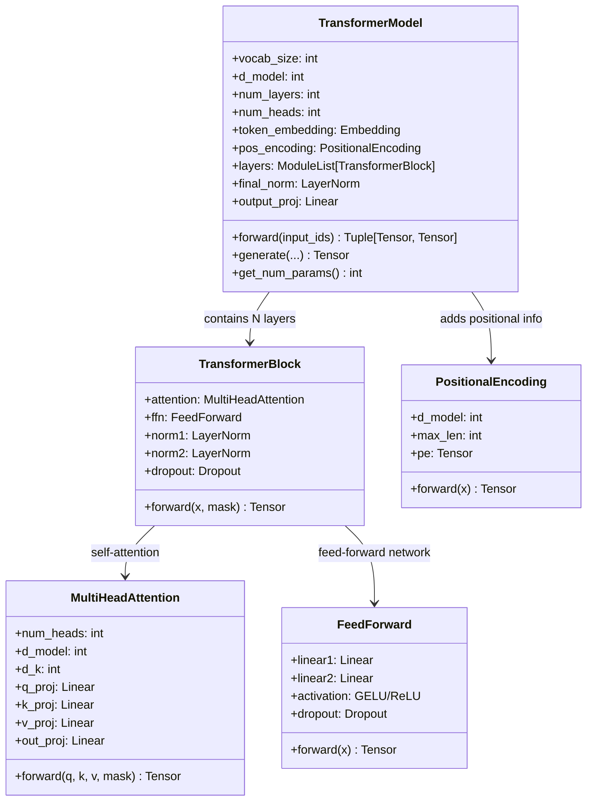

---

## Inference Pipeline

### Text Generation Flow

```mermaid
flowchart TD
    Start([python inference.py<br/>--checkpoint path<br/>--prompt text]) --> LoadModel[Load Model from Checkpoint<br/>Load state dict<br/>Set to eval mode]
    
    LoadModel --> CreateTokenizer[Create Tokenizer<br/>SimpleTokenizer]
    
    CreateTokenizer --> EncodePrompt[Encode Prompt<br/>Text → Token IDs]
    
    EncodePrompt --> CheckOptimized{Use Optimized<br/>Inference?}
    
    CheckOptimized -->|Yes| OptimizedGen[OptimizedInference<br/>with KV Caching]
    CheckOptimized -->|No| StandardGen[Standard Generation]
    
    StandardGen --> InitGen[Initialize Generation<br/>generated = input_ids]
    
    InitGen --> LoopStart[Generation Loop<br/>For max_length steps]
    
    LoopStart --> Forward[Forward Pass<br/>Model prediction]
    
    Forward --> NextToken[Get Next Token Logits<br/>Last position]
    
    NextToken --> Temperature[Apply Temperature<br/>Scale logits]
    
    Temperature --> TopK{Top-K<br/>Filtering?}
    
    TopK -->|Yes| FilterK[Filter Top-K Tokens]
    TopK -->|No| TopP{Top-P<br/>Nucleus Sampling?}
    
    FilterK --> TopP
    
    TopP -->|Yes| FilterP[Filter by Cumulative Prob]
    TopP -->|No| Sample[Sample Token<br/>Multinomial]
    
    FilterP --> Sample
    
    Sample --> Append[Append Token<br/>to Generated]
    
    Append --> CheckStop{Stop<br/>Condition?}
    
    CheckStop -->|No| LoopStart
    CheckStop -->|Yes| Decode[Decode Tokens<br/>Token IDs → Text]
    
    OptimizedGen --> KVCache[Use KV Cache<br/>Cache previous KV]
    KVCache --> LoopStart
    
    Decode --> Output[Generated Text<br/>Output]
    
    Output --> End([End])
    
    style OptimizedGen fill:#e1f5ff
    style Forward fill:#ffe1f5
    style Sample fill:#fff4e1
    style Output fill:#e1ffe1
```

### Optimized Inference with KV Caching

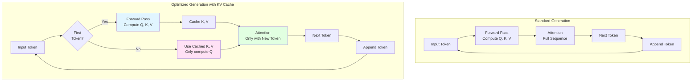

---

## Complete Workflow

### End-to-End System Flow

```mermaid
flowchart TB
    subgraph "Phase 1: Data Preparation"
        A1[Raw Data Files<br/>PDFs, Images, Code, Text] --> A2[DataProcessor<br/>Extract Text]
        A2 --> A3[Text Lines<br/>List of Strings]
        A3 --> A4[SimpleTokenizer<br/>Build Vocabulary]
        A4 --> A5[Tokenize & Chunk<br/>Create Sequences]
        A5 --> A6[DataLoader<br/>Batched Data]
    end
    
    subgraph "Phase 2: Model Initialization"
        B1[Load Config<br/>ModelConfig] --> B2[Set Random Seed<br/>seed=42]
        B2 --> B3[Create Model<br/>TransformerModel]
        B3 --> B4[Initialize Weights<br/>Normal Distribution]
        B4 --> B5[Create Optimizer<br/>AdamW]
        B5 --> B6[Create Scheduler<br/>CosineAnnealingLR]
    end
    
    subgraph "Phase 3: Training"
        C1[Trainer Setup] --> C2[Training Loop<br/>Epochs]
        C2 --> C3[Batch Loop]
        C3 --> C4[Forward Pass]
        C4 --> C5[Compute Loss]
        C5 --> C6[Backward Pass]
        C6 --> C7[Gradient Clipping]
        C7 --> C8[Update Weights]
        C8 --> C9[Save Checkpoint]
        C9 --> C10{More Epochs?}
        C10 -->|Yes| C2
        C10 -->|No| C11[Generate Plots<br/>Training Metrics]
    end
    
    subgraph "Phase 4: Inference"
        D1[Load Checkpoint] --> D2[Load Model State]
        D2 --> D3[Encode Prompt]
        D3 --> D4[Generate Text<br/>Autoregressive]
        D4 --> D5[Decode Tokens]
        D5 --> D6[Output Text]
    end
    
    A6 --> B1
    B6 --> C1
    C11 --> D1
    
    style A2 fill:#e1f5ff
    style B3 fill:#fff4e1
    style C4 fill:#ffe1f5
    style D4 fill:#e1ffe1
```

### Checkpoint Structure

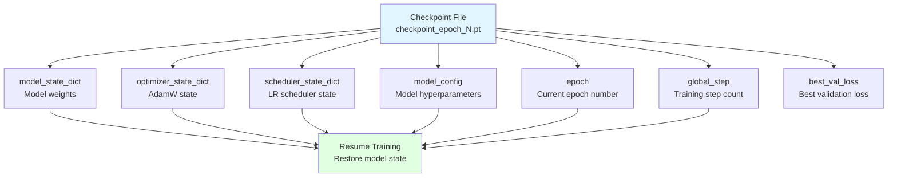

### Configuration Hierarchy

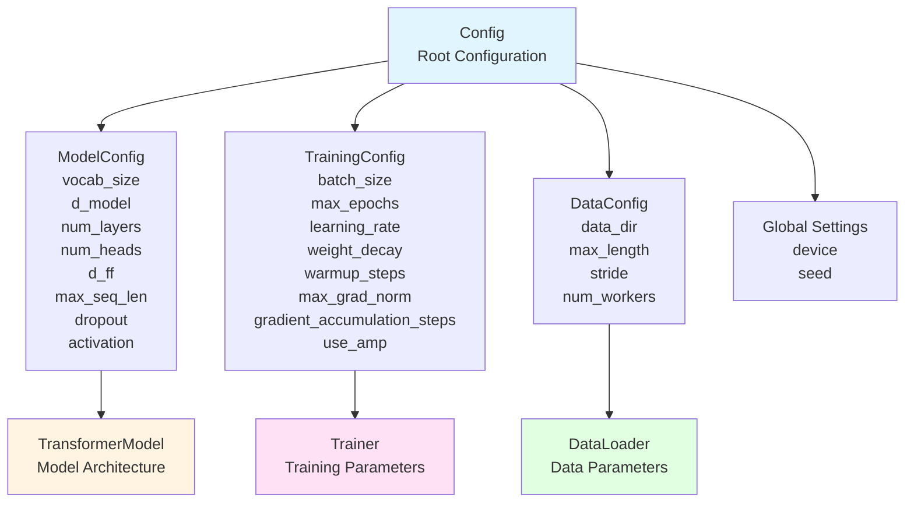

---

## Key Components Summary

### 1. **Data Processing**
- **DataProcessor**: Multi-format text extraction (PDFs, images, code, text)
- **SimpleTokenizer**: Character-level tokenization
- **TextDataset**: PyTorch dataset for training
- **DataLoader**: Batched data loading

### 2. **Model Architecture**
- **TransformerModel**: Complete transformer language model
- **TransformerBlock**: Multi-head attention + feed-forward
- **MultiHeadAttention**: Scaled dot-product attention with causal masking
- **FeedForward**: Position-wise feed-forward network
- **PositionalEncoding**: Sinusoidal position embeddings

### 3. **Training**
- **Trainer**: Complete training loop with:
  - Gradient accumulation
  - Mixed precision training (AMP)
  - Gradient clipping
  - Learning rate scheduling
  - Checkpointing
  - Metrics tracking

### 4. **Inference**
- **Standard Generation**: Autoregressive text generation
- **OptimizedInference**: KV caching for faster generation
- **RetrievalCache**: Caching for RAG systems

### 5. **Configuration**
- **Config System**: Hierarchical configuration (Model, Training, Data)
- **JSON Support**: Save/load configurations
- **Default Values**: Sensible defaults for all parameters

---

## Usage Examples

### Training
```bash
# Basic training
python train.py --data /path/to/data

# With custom config
python train.py --data /path/to/data --config config.json

# Resume from checkpoint
python train.py --data /path/to/data --resume checkpoints/checkpoint_epoch_5.pt

# Specify device
python train.py --data /path/to/data --device cuda
```

### Inference
```bash
# Basic inference
python inference.py --checkpoint checkpoints/best_checkpoint.pt --prompt "Hello world"

# With sampling parameters
python inference.py \
    --checkpoint checkpoints/best_checkpoint.pt \
    --prompt "The future of AI" \
    --max-length 200 \
    --temperature 0.8 \
    --top-k 50 \
    --top-p 0.95

# Optimized inference
python inference.py \
    --checkpoint checkpoints/best_checkpoint.pt \
    --prompt "Hello" \
    --optimized
```

---

## File Structure

```
sheepOp/
├── train.py              # Main training script
├── inference.py          # Inference script
├── config.py            # Configuration management
├── config.json          # Configuration file
├── data/                # Data module (symlink)
│   └── __init__.py      # Tokenizer, DataLoader, DataProcessor
├── models/              # Model definitions
│   ├── transformer.py  # Main transformer model
│   ├── blocks.py        # Transformer blocks
│   ├── attention.py     # Attention mechanisms
│   └── optimized_attention.py  # Optimized inference
├── training/            # Training utilities
│   ├── __init__.py      # Trainer class
│   └── metrics.py       # Training metrics
├── checkpoints/         # Saved model checkpoints
└── requirements.txt     # Dependencies
```

---

## Flow Summary

1. **Data Ingestion**: Raw files → Text extraction → Text lines
2. **Tokenization**: Text lines → Token sequences → Batched data
3. **Model Setup**: Config → Model → Optimizer → Scheduler
4. **Training**: Batches → Forward → Loss → Backward → Update → Checkpoint
5. **Inference**: Checkpoint → Model → Prompt → Generate → Output

---

*This documentation provides a complete view of the SheepOp LLM project architecture and workflow.*

