# Inference Benchmarking Guide

This guide explains how to use the benchmarking feature to compare optimized vs non-optimized inference performance for research purposes.

## Overview

The benchmarking feature runs inference both with and without optimizations (KV caching, optimized attention) and generates:

- **Performance metrics** (tokens/sec, latency, memory usage)
- **Comparison plots** (visual charts showing improvements)
- **CSV export** (data for further analysis)

## Data Storage Location

**All benchmark data is saved to:** `./inference_benchmarks/` (default)

**You can customize the location:**

```bash
python inference.py --benchmark --benchmark-dir ./research/results
```

**Data files created:**

- `inference_metrics.json` - All raw metrics (JSON format)
- `inference_metrics.csv` - Spreadsheet-friendly data (CSV format)
- `optimization_comparison.png` - Visual comparison charts
- `performance_over_time.png` - Trend analysis over multiple runs

**Note:** All runs accumulate in the same files, so you can run multiple benchmarks and build trends over time.

## Quick Start

### Basic Benchmark

```bash
python inference.py \
    --checkpoint checkpoints/best_checkpoint.pt \
    --prompt "The future of artificial intelligence" \
    --max-length 100 \
    --benchmark
```

This will:

1. Run inference **without** optimizations
2. Run inference **with** optimizations (KV cache)
3. Collect metrics for both runs
4. Generate comparison plots
5. Save all data to `./inference_benchmarks/`

### Custom Benchmark Directory

```bash
python inference.py \
    --checkpoint checkpoints/best_checkpoint.pt \
    --prompt "Your prompt here" \
    --max-length 100 \
    --benchmark \
    --benchmark-dir ./research/results
```

### Running Multiple Prompts for Trends

**Use the batch benchmark script** to run multiple prompts and create trends:

```bash
# Create a prompts file
cat > prompts.txt << EOF
The future of artificial intelligence
Machine learning is transforming
Deep neural networks enable
Natural language processing requires
EOF

# Run batch benchmarks
python benchmark_batch.py \
    --checkpoint checkpoints/best_checkpoint.pt \
    --prompt-file prompts.txt \
    --max-length 100 \
    --benchmark-dir ./research/results
```

**Or use command-line prompts:**

```bash
python benchmark_batch.py \
    --checkpoint checkpoints/best_checkpoint.pt \
    --prompts "Prompt 1" "Prompt 2" "Prompt 3" \
    --max-length 100
```

**Results accumulate** in the same files, allowing you to:

- Build trends across multiple prompts
- Analyze performance consistency
- Create comprehensive research reports

## Output Files

After running a benchmark, you'll get:

### 1. JSON Metrics File

**Location:** `inference_benchmarks/inference_metrics.json`

Contains all raw metrics data:

```json
{
  "runs": [
    {
      "run_name": "run_1234567890_optimized",
      "optimized": true,
      "tokens_per_second": 150.5,
      "time_per_token": 6.64,
      "memory_used_mb": 245.3,
      ...
    },
    ...
  ]
}
```

### 2. CSV Export

**Location:** `inference_benchmarks/inference_metrics.csv`

For spreadsheet analysis:

```csv
run_name,timestamp,optimized,prompt_length,generated_length,total_time,tokens_per_second,time_per_token,memory_used_mb,device
run_1234567890_optimized,1234567890.5,true,20,100,0.663,150.8,6.63,245.3,cuda
...
```

### 3. Comparison Plot

**Location:** `inference_benchmarks/optimization_comparison.png`

Shows 4 charts:

- **Tokens per Second** (speed comparison)
- **Time per Token** (latency comparison)
- **Total Generation Time** (overall speed)
- **Memory Usage** (memory efficiency)

### 4. Performance Over Time Plot

**Location:** `inference_benchmarks/performance_over_time.png`

Shows how performance varies across multiple benchmark runs.

## Metrics Collected

### Performance Metrics

- **Tokens per Second**: Generation speed
- **Time per Token**: Latency per token (milliseconds)
- **Total Time**: Complete generation time

### Resource Metrics

- **Memory Usage**: GPU memory consumption (MB)
- **Device**: Device used (cuda/cpu/mps)

### Derived Metrics

- **Speedup**: Ratio of optimized vs non-optimized speed
- **Memory Reduction**: Percentage reduction in memory usage

## Example Output

```
🔬 BENCHMARK MODE: Comparing optimized vs non-optimized inference
======================================================================

BENCHMARK RUN: run_1234567890
======================================================================

🔴 Running NON-OPTIMIZED inference...
  ⏱️  Total Time: 1.234 s
  📊 Tokens/Second: 81.0
  ⚡ Time/Token: 12.35 ms
  💾 Memory Used: 512.3 MB
  📝 Generated: The future of artificial intelligence is bright...

🟢 Running OPTIMIZED inference...
  ⏱️  Total Time: 0.663 s
  📊 Tokens/Second: 150.8
  ⚡ Time/Token: 6.63 ms
  💾 Memory Used: 245.3 MB
  📝 Generated: The future of artificial intelligence is bright...

🚀 SPEEDUP: 1.86x faster with optimizations
💾 MEMORY REDUCTION: 52.1%

📊 Generating comparison plots and data...
📊 Comparison plot saved to: ./inference_benchmarks/optimization_comparison.png
📊 Performance over time plot saved to: ./inference_benchmarks/performance_over_time.png
📊 Metrics exported to CSV: ./inference_benchmarks/inference_metrics.csv

✅ Benchmark complete! Results saved to: ./inference_benchmarks
```

## Running Multiple Benchmarks for Trends

### Method 1: Individual Runs (Manual)

```bash
# Run 1
python inference.py --checkpoint checkpoints/best.pt --prompt "Prompt 1" --benchmark

# Run 2
python inference.py --checkpoint checkpoints/best.pt --prompt "Prompt 2" --benchmark

# Run 3
python inference.py --checkpoint checkpoints/best.pt --prompt "Prompt 3" --max-length 200 --benchmark
```

All runs accumulate in the same files:

- `inference_metrics.json` - All runs appended
- `inference_metrics.csv` - All runs in CSV format
- Plots update automatically with new data

### Method 2: Batch Script (Recommended)

**Create a prompts file:**

```bash
cat > research_prompts.txt << EOF
The future of artificial intelligence is bright.
Machine learning models are becoming more efficient.
Deep neural networks can process complex patterns.
Natural language processing enables human-computer interaction.
Transformer architectures revolutionized NLP.
EOF
```

**Run batch benchmarks:**

```bash
python benchmark_batch.py \
    --checkpoint checkpoints/best_checkpoint.pt \
    --prompt-file research_prompts.txt \
    --max-length 100 \
    --benchmark-dir ./research/results \
    --delay 2.0
```

**Benefits:**

- ✅ Runs all prompts automatically
- ✅ Accumulates data for trend analysis
- ✅ Creates comprehensive performance reports
- ✅ Handles errors gracefully

**After running multiple benchmarks:**

- Check `performance_over_time.png` for trends
- Analyze `inference_metrics.csv` in Excel/Python
- Review aggregated statistics in console output

## Research Use Cases

### 1. Performance Analysis

Compare how optimizations affect inference speed:

```bash
python inference.py \
    --checkpoint checkpoints/best.pt \
    --prompt "Your research prompt" \
    --benchmark
```

### 2. Memory Efficiency Study

Analyze memory usage improvements:

```bash
# Check memory reduction
python inference.py --checkpoint checkpoints/best.pt --prompt "Long prompt" --max-length 500 --benchmark
```

### 3. Scalability Testing

Test with different generation lengths:

```bash
# Short sequences
python inference.py --checkpoint checkpoints/best.pt --prompt "Test" --max-length 50 --benchmark

# Medium sequences
python inference.py --checkpoint checkpoints/best.pt --prompt "Test" --max-length 200 --benchmark

# Long sequences
python inference.py --checkpoint checkpoints/best.pt --prompt "Test" --max-length 1000 --benchmark
```

## Plot Interpretation

### Comparison Plot (`optimization_comparison.png`)

**Top Left - Tokens per Second:**

- Higher is better
- Shows generation speed
- Speedup annotation shows improvement factor

**Top Right - Time per Token:**

- Lower is better
- Shows latency per token
- Important for real-time applications

**Bottom Left - Total Generation Time:**

- Lower is better
- Overall generation time
- Most user-visible metric

**Bottom Right - Memory Usage:**

- Lower is better
- GPU memory consumption
- Memory reduction annotation shows savings

### Performance Over Time Plot (`performance_over_time.png`)

Shows performance trends across multiple benchmark runs:

- **Green line**: Optimized performance
- **Red line**: Non-optimized performance
- Useful for finding performance regressions or improvements

## Reporting Results

### Speedup Calculation

```
Speedup = Optimized Tokens/Second / Non-Optimized Tokens/Second
```

**Example:**

- Optimized: 150 tokens/sec
- Non-Optimized: 81 tokens/sec
- Speedup: 150/81 = 1.85x faster

### Memory Reduction Calculation

```
Memory Reduction % = (1 - Optimized Memory / Non-Optimized Memory) × 100
```

**Example:**

- Optimized: 245 MB
- Non-Optimized: 512 MB
- Reduction: (1 - 245/512) × 100 = 52.1%

## Tips for Best Results

1. **Warm Up GPU**: Run a few inference calls before benchmarking to warm up the GPU
2. **Clear Cache**: The benchmark automatically clears CUDA cache between runs
3. **Multiple Runs**: Run multiple benchmarks for statistical significance
4. **Consistent Prompts**: Use the same prompt for fair comparison
5. **Device Consistency**: Use the same device for all runs

## Command Line Options

```bash
python inference.py \
    --checkpoint PATH          # Path to model checkpoint (required)
    --prompt TEXT              # Prompt text (required)
    --max-length INT           # Maximum generation length (default: 100)
    --temperature FLOAT        # Sampling temperature (default: 1.0)
    --top-k INT                # Top-k sampling (default: 50)
    --top-p FLOAT              # Top-p sampling (default: 0.95)
    --device DEVICE            # Device: cuda/cpu/mps (default: cuda)
    --benchmark                # Enable benchmarking mode
    --benchmark-dir DIR        # Benchmark output directory (default: ./inference_benchmarks)
```

## Troubleshooting

### No GPU Memory Stats

If memory stats show as `None`:

- CUDA: Memory tracking should work automatically
- MPS (Apple Silicon): Memory tracking not available
- CPU: Memory tracking not available

### Plots Not Generated

If plots fail to generate:

- Ensure `matplotlib` is installed: `pip install matplotlib`
- Check file permissions for output directory

### Inconsistent Results

For consistent results:

- Use same device for all runs
- Use same prompt length
- Allow GPU to warm up
- Close other GPU applications

## Example Research Workflow

```bash
# 1. Run initial benchmark
python inference.py --checkpoint checkpoints/best.pt --prompt "Test prompt" --benchmark

# 2. Review results
ls inference_benchmarks/
cat inference_benchmarks/inference_metrics.json

# 3. Generate plots (already done automatically)
# View: inference_benchmarks/optimization_comparison.png

# 4. Analyze CSV data
# Open: inference_benchmarks/inference_metrics.csv in Excel/Python

# 5. Run additional benchmarks
python inference.py --checkpoint checkpoints/best.pt --prompt "Different prompt" --max-length 200 --benchmark

# 6. Compare results
python inference.py --checkpoint checkpoints/best.pt --prompt "Same prompt" --benchmark
```

## Optimization Architecture & Code Injection

### Overview: Optimization Layers

The optimizations are implemented as layers that wrap the standard inference pipeline:


### Detailed Optimization Flow

```mermaid

flowchart LR
 subgraph subGraph0["Request Flow"]
        Mode{"Optimized?"}
        Start["Benchmark Request"]
        Standard["Standard Path"]
        Optimized["Optimized Path"]
  end
 subgraph subGraph1["Standard Path"]
        S1["Model.generate"]
        S2["Transformer Forward"]
        S3["MultiHeadAttention"]
        S4["Compute Q, K, V"]
        S5["Recompute All KVs"]
        S6["Attention Scores: O(n²)"]
        S7["Generate Token"]
  end
 subgraph subGraph2["Optimized Path"]
        O1["OptimizedInference"]
        O2["Init KV Cache"]
        O3["Transformer Forward"]
        O4["OptimizedMultiHeadAttention"]
        O5["Compute Q, K, V"]
        O6["KV Cache Layer"]
        O7["Append to Cache"]
        O8["Reuse Cached KVs"]
        O9["Attention Scores: O(n)"]
        O10["Generate Token"]
  end
    Start --> Mode
    Mode -- No --> Standard
    Mode -- Yes --> Optimized
    Standard --> S1
    S1 --> S2
    S2 --> S3
    S3 --> S4
    S4 --> S5
    S5 --> S6
    S6 --> S7
    Optimized --> O1
    O1 --> O2
    O2 --> O3
    O3 --> O4
    O4 --> O5
    O5 --> O6
    O6 --> O7
    O7 --> O8
    O8 --> O9
    O9 --> O10
    S7 --> Metrics["Collect Metrics"]
    O10 --> Metrics
    style Standard fill:#ffcccc
    style Optimized fill:#ccffcc
    style S5 fill:#ffcccc
    style O8 fill:#ccffcc

```



### Code Injection Points


### Benchmark Execution Flow


### Optimization Components Stack


### Performance Comparison Schema


## Data File Locations Summary

**All benchmark data is saved to:**

```
./inference_benchmarks/
├── inference_metrics.json          # All raw metrics (JSON)
├── inference_metrics.csv           # Spreadsheet data (CSV)
├── optimization_comparison.png     # Comparison charts
└── performance_over_time.png       # Trend analysis
```

**Custom location:**

```bash
--benchmark-dir ./research/results
```

**Data accumulates:** Each benchmark run appends to the same files, building trends over time.

## Next Steps

1. ✅ Run your first benchmark
2. ✅ Review the comparison plots
3. ✅ Analyze CSV data for deeper insights
4. ✅ Run multiple benchmarks for statistical analysis
5. ✅ Use batch script for trend analysis
6. ✅ Include results in your research paper/presentation

---

**Happy Benchmarking!** 📊🔬
