# SheepOp LLM 🐑➡️🤖

A modern language model implementation from scratch, incorporating insights from recent research papers.

## License

This project is licensed under the **Apache License 2.0**.

See [LICENSE](../LICENSE) or [LICENSE.txt](../LICENSE.txt) for the full license text.

**Summary:**
- ✅ Free to use, modify, and distribute
- ✅ Commercial use allowed
- ✅ Patent grant included
- ✅ Private use allowed
- ⚠️ Must include license and copyright notice
- ⚠️ Must state changes if modifying

## Table of Contents

- [What is This?](#what-is-this)
- [Features](#features)
- [Quick Start](#quick-start)
- [Mathematical Foundations](#mathematical-foundations)
- [Architecture Explained](#architecture-explained)
- [Project Structure](#project-structure)
- [Installation](#installation)
- [Usage](#usage)
- [Configuration](#configuration)
- [Diagrams](#diagrams)
- [References](#references)

## What is This?

A Transformer-based language model implementing autoregressive next-token prediction using multi-head self-attention, positional encoding, and modern training optimizations (mixed precision, gradient accumulation, KV caching).

The model learns to write by reading large amounts of text, discovering patterns like "after 'the cat' usually comes 'sat' or 'ran'", enabling it to generate coherent sentences. It processes text sequentially, predicting each next word based on the context provided by previous words.

## Features

- **Transformer Architecture**: Multi-head self-attention mechanism from "Attention Is All You Need"
- **Long Context Support**: Efficient handling of long sequences with Rotary Positional Encoding (RoPE)
- **Training Optimizations**: Mixed precision training, gradient accumulation, gradient clipping
- **Modern Best Practices**: Pre-norm architecture, GELU activation, weight tying
- **Comprehensive Evaluation**: Perplexity, accuracy metrics, and generation utilities

## Quick Start

**Option 1: Automated Setup (Recommended)**

```bash
# Run the setup script - it handles everything automatically!
./setup.sh

# Then activate the virtual environment
source venv/bin/activate

# Download data and train
python3 download_large_data.py wiki --version 103
python3 train.py --data data/wikitext_103.txt --config config.json --device cuda
```

**Option 2: Manual Setup**

```bash
# 1. Create and activate virtual environment (REQUIRED on modern Linux systems)
python3 -m venv venv
source venv/bin/activate

# 2. Upgrade pip
pip install --upgrade pip

# 3. Install dependencies
pip install -r requirements.txt

# 4. Download data
python3 download_large_data.py wiki --version 103

# 5. Train
python3 train.py --data data/wikitext_103.txt --config config.json --device cuda

# 6. Generate
python3 inference.py --checkpoint checkpoints/checkpoint_epoch_10.pt \
    --prompt "The future of artificial intelligence" --device cuda
```

**Note:** On modern Debian/Ubuntu systems (especially Python 3.12+), pip prevents system-wide installations to protect system packages. Always use a virtual environment (`python3 -m venv venv`) before installing dependencies.

See [GETTING_STARTED.md](GETTING_STARTED.md) for detailed instructions.

## Mathematical Foundations

### 1. Token Embedding

Words are converted into numerical representations that the model can process. Each word (token) is assigned a unique ID, which is then mapped to a dense vector representation - think of it as converting words into a format the computer can understand and manipulate mathematically.

**Mathematical Formulation**:

Given a vocabulary of size $V$ and token ID $t \in \{0, 1, \ldots, V-1\}$:

$$
\mathbf{E}_t = \text{EmbeddingTable}[t] \in \mathbb{R}^{d_{\text{model}}}
$$

where $\mathbf{E} \in \mathbb{R}^{V \times d_{\text{model}}}$ is the learnable embedding matrix.

### 2. Positional Encoding

Word order is crucial in language - "Cat bites dog" is very different from "Dog bites cat". Since transformers process all tokens simultaneously, we need to inject positional information so the model knows which word comes first, second, third, etc.

**Mathematical Formulation**:

**Sinusoidal Positional Encoding** (for position $pos$ and dimension $i$):

$$
PE_{(pos, 2i)} = \sin\left(\frac{pos}{10000^{2i/d_{\text{model}}}}\right)
$$

$$
PE_{(pos, 2i+1)} = \cos\left(\frac{pos}{10000^{2i/d_{\text{model}}}}\right)
$$

The final embedding combines token and position:

$$
\mathbf{h}_i = \mathbf{E}_{t_i} + PE(i)
$$

where $t_i$ is the token at position $i$.

### 3. Multi-Head Self-Attention

Attention mechanisms allow the model to understand relationships between words in a sentence. When reading "The cat sat on the mat", the model learns to connect "cat" with "sat" because they're related. Multi-head attention enables the model to focus on different types of relationships simultaneously - syntax, semantics, and context.

**Mathematical Formulation**:

Given input $\mathbf{X} \in \mathbb{R}^{n \times d_{\text{model}}}$ with $n$ tokens:

1. **Project to Query, Key, Value**:

```math
   \mathbf{Q} = \mathbf{X}\mathbf{W}_Q, \quad \mathbf{K} = \mathbf{X}\mathbf{W}_K, \quad \mathbf{V} = \mathbf{X}\mathbf{W}_V

   where $\mathbf{W}_Q, \mathbf{W}_K, \mathbf{W}_V \in \mathbb{R}^{d_{\text{model}} \times d_{\text{model}}}$
```

2. **Scaled Dot-Product Attention**:

```math
   \text{Attention}(\mathbf{Q}, \mathbf{K}, \mathbf{V}) = \text{softmax}\left(\frac{\mathbf{Q}\mathbf{K}^T}{\sqrt{d_k}}\right)\mathbf{V}
```

3. **Multi-Head Attention** splits into $h$ heads:

```math
   \text{head}_i = \text{Attention}(\mathbf{Q}_i, \mathbf{K}_i, \mathbf{V}_i)

   \text{MultiHead}(\mathbf{Q}, \mathbf{K}, \mathbf{V}) = \text{Concat}(\text{head}_1, \ldots, \text{head}_h)\mathbf{W}_O

   where $d_k = d_{\text{model}} / h$ (each head has dimension $d_k$).
```

4. **Causal Masking** (for autoregressive generation):

```math
   M_{ij} = \begin{cases}
   0 & \text{if } i \geq j \\
   -\infty & \text{if } i < j
   \end{cases}
   \text{Attention}(\mathbf{Q}, \mathbf{K}, \mathbf{V}, M) = \text{softmax}\left(\frac{\mathbf{Q}\mathbf{K}^T}{\sqrt{d_k}} + M\right)\mathbf{V}
```

### 4. Feed-Forward Network

After attention identifies which words relate to each other, the feed-forward network performs non-linear transformations on the information. This step allows the model to synthesize and combine the attended information, similar to mixing ingredients to create a final output.

**Mathematical Formulation**:

```math
\text{FFN}(\mathbf{x}) = \text{GELU}(\mathbf{x}\mathbf{W}_1 + \mathbf{b}_1)\mathbf{W}_2 + \mathbf{b}_2

where $\mathbf{W}_1 \in \mathbb{R}^{d_{\text{model}} \times d_{ff}}$, $\mathbf{W}_2 \in \mathbb{R}^{d_{ff} \times d_{\text{model}}}$, and typically $d_{ff} = 4 \times d_{\text{model}}$.
```

**GELU Activation**:

```math
\text{GELU}(x) = x \cdot \Phi(x) = x \cdot \frac{1}{2}\left(1 + \text{erf}\left(\frac{x}{\sqrt{2}}\right)\right)

where $\Phi(x)$ is the cumulative distribution function of the standard normal distribution.
```

### 5. Transformer Block (Pre-Norm Architecture)

**For Kids**: Imagine building with LEGO blocks. Each block does something special (attention or thinking), and you can stack many blocks on top of each other to build something amazing!

**Mathematical Formulation**:

For a transformer block with input $\mathbf{x}$:

1. **Self-Attention Sublayer**:

```math
   \mathbf{x}' = \mathbf{x} + \text{Dropout}\left(\text{MultiHead}(\text{LayerNorm}(\mathbf{x}))\right)
```

2. **Feed-Forward Sublayer**:

```math
   \mathbf{x}'' = \mathbf{x}' + \text{Dropout}\left(\text{FFN}(\text{LayerNorm}(\mathbf{x}'))\right)
```

**Layer Normalization**:

```math
\text{LayerNorm}(\mathbf{x}) = \gamma \odot \frac{\mathbf{x} - \mu}{\sqrt{\sigma^2 + \epsilon}} + \beta

where $\mu = \frac{1}{d}\sum_{i=1}^d x_i$, $\sigma^2 = \frac{1}{d}\sum_{i=1}^d (x_i - \mu)^2$, and $\gamma, \beta$ are learnable parameters.
```

### 6. Complete Forward Pass

**For Kids**: Think of it like an assembly line! The words go through many stations (layers), each doing something special, until finally we get a prediction of what word comes next.

**Mathematical Formulation**:

Given input token sequence $\mathbf{t} = [t_1, t_2, \ldots, t_n]$:

$$
\mathbf{h}_0 = \mathbf{E}[\mathbf{t}] + PE(\mathbf{t}) \quad \text{(token embeddings + positional encoding)}
$$

$$
\mathbf{h}_1 = \text{TransformerBlock}_1(\mathbf{h}_0)
$$

$$
\mathbf{h}_2 = \text{TransformerBlock}_2(\mathbf{h}_1)
$$

$$
\vdots
$$

$$
\mathbf{h}_L = \text{TransformerBlock}_L(\mathbf{h}_{L-1})
$$

$$
\mathbf{o} = \text{LayerNorm}(\mathbf{h}_L) \quad \text{(final normalization)}
$$

$$
\mathbf{y} = \mathbf{o}\mathbf{W}_{\text{out}} \quad \text{(output projection)}
$$

$$
p(t_{n+1} | t_1, \ldots, t_n) = \text{softmax}(\mathbf{y}_n) \quad \text{(next token probability)}
$$

### 7. Training Objective (Cross-Entropy Loss)

**For Kids**: When we train, we show the computer a sentence and ask "what word comes next?" If it guesses wrong, we say "try again!" and it learns from its mistake.

**Mathematical Formulation**:

For a sequence of tokens $\mathbf{t} = [t_1, t_2, \ldots, t_n]$:

$$
\mathcal{L} = -\frac{1}{n-1}\sum_{i=1}^{n-1} \log p(t_{i+1} | t_1, \ldots, t_i)
$$

**Perplexity** (measure of model confidence):

$$
\text{Perplexity} = \exp(\mathcal{L}) = \exp\left(-\frac{1}{n-1}\sum_{i=1}^{n-1} \log p(t_{i+1} | t_1, \ldots, t_i)\right)
$$

Lower perplexity = better model!

### 8. Text Generation (Autoregressive Sampling)

**For Kids**: The computer writes one word at a time. After each word, it thinks "what word makes sense next?" and picks one.

**Mathematical Formulation**:

Given prompt $\mathbf{p} = [p_1, \ldots, p_k]$:

1. Initialize: $\mathbf{s} = \mathbf{p}$
2. For $i = k+1, \ldots, k+n$:

$$
\mathbf{h}_i = \text{Transformer}(\mathbf{s})
$$

$$
\mathbf{p}_i = \text{softmax}(\mathbf{h}_i / \tau) \quad \text{(with temperature $\tau \geq 1$)}
$$

$$
t_i \sim \text{Sample}(\mathbf{p}_i) \quad \text{(sample next token)}
$$

$$
\mathbf{s} = \mathbf{s} \cup \{t_i\} \quad \text{(append to sequence)}
$$

**Top-k Sampling**:

$$
\mathbf{p}_i' = \begin{cases}
\mathbf{p}_i[j] & \text{if } j \in \text{top}_k(\mathbf{p}_i) \\
0 & \text{otherwise}
\end{cases}
$$

**Top-p (Nucleus) Sampling**:
Find smallest set $S$ such that $\sum_{j \in S} \mathbf{p}_i[j] \geq p$, then:

$$
\mathbf{p}_i'[j] = \begin{cases}
\mathbf{p}_i[j] & \text{if } j \in S \\
0 & \text{otherwise}
\end{cases}
$$

### 9. Optimization (AdamW)

**For Kids**: Learning is like climbing a mountain. You take small steps in the right direction. AdamW is like having a smart guide that knows which direction is best and adjusts your step size automatically!

**Mathematical Formulation**:

For parameter $\theta$ with gradient $\mathbf{g}_t$ at step $t$:

**Momentum**:

$$
\mathbf{m}_t = \beta_1 \mathbf{m}_{t-1} + (1 - \beta_1) \mathbf{g}_t
$$

**RMSprop**:

$$
\mathbf{v}_t = \beta_2 \mathbf{v}_{t-1} + (1 - \beta_2) \mathbf{g}_t^2
$$

**Bias Correction**:

$$
\hat{\mathbf{m}}_t = \frac{\mathbf{m}_t}{1 - \beta_1^t}, \quad \hat{\mathbf{v}}_t = \frac{\mathbf{v}_t}{1 - \beta_2^t}
$$

**Parameter Update**:

$$
\theta_t = \theta_{t-1} - \eta \left(\frac{\hat{\mathbf{m}}_t}{\sqrt{\hat{\mathbf{v}}_t} + \epsilon} + \lambda \theta_{t-1}\right)
$$

where $\eta$ is learning rate, $\lambda$ is weight decay, and typically $\beta_1 = 0.9$, $\beta_2 = 0.999$.

### 10. Gradient Clipping

**For Kids**: Sometimes the computer gets too excited and tries to learn too fast (like running too fast down a hill). We slow it down so it doesn't fall!

**Mathematical Formulation**:

$$
\mathbf{g}_{\text{clipped}} = \begin{cases}
\mathbf{g} & \text{if } \|\mathbf{g}\| \leq \theta_{\max} \\
\mathbf{g} \cdot \frac{\theta_{\max}}{\|\mathbf{g}\|} & \text{if } \|\mathbf{g}\| > \theta_{\max}
\end{cases}
$$

where $\theta_{\max}$ is the maximum gradient norm (typically 1.0).

## Architecture Explained

### High-Level Overview

**For Kids**:

```
📚 Text Input → 🔤 Turn into Numbers → 🧠 Thinking Layers → ✨ Predict Next Word → 📝 Generate Text
```

**For Scientists**:

```
Token IDs → Embeddings → Positional Encoding → N× Transformer Blocks → Output Projection → Logits → Sampling → Text
```

### Detailed Architecture

```
┌─────────────────────────────────────────────────────────────────┐
│                         INPUT TEXT                              │
│                  "The cat sat on the mat"                       │
└──────────────────────────┬──────────────────────────────────────┘
                           │
                           ▼
┌─────────────────────────────────────────────────────────────────┐
│                     TOKENIZATION                                │
│  [1, 45, 123, 67, 45, 234]  (each word → number)                │
└──────────────────────────┬──────────────────────────────────────┘
                           │
                           ▼
┌─────────────────────────────────────────────────────────────────┐
│                   TOKEN EMBEDDING                               │
│  E ∈ ℝ^(V×d_model)  |  Each token → vector of size d_model      │
│  [1, 45, ...] → [[0.1, 0.3, ...], [0.2, -0.1, ...], ...]        │
└──────────────────────────┬──────────────────────────────────────┘
                           │
                           ▼
┌─────────────────────────────────────────────────────────────────┐
│                POSITIONAL ENCODING                              │
│  PE(pos, 2i) = sin(pos / 10000^(2i/d_model))                    │
│  h_i = E[t_i] + PE(i)  (add position info)                      │
└──────────────────────────┬──────────────────────────────────────┘
                           │
                           ▼
┌─────────────────────────────────────────────────────────────────┐
│              TRANSFORMER BLOCK 1                                │
│  ┌──────────────────────────────────────────────┐               │
│  │  Pre-Norm Multi-Head Attention               │               │
│  │  Attention(Q, K, V) = softmax(QK^T/√d_k)V    │               │
│  │  + Residual Connection                       │               │
│  └──────────────────────────────────────────────┘               │
│  ┌──────────────────────────────────────────────┐               │
│  │  Pre-Norm Feed-Forward Network               │               │
│  │  FFN(x) = GELU(xW₁ + b₁)W₂ + b₂              │               │
│  │  + Residual Connection                       │               │
│  └──────────────────────────────────────────────┘               │
└──────────────────────────┬──────────────────────────────────────┘
                           │
                           ▼
┌─────────────────────────────────────────────────────────────────┐
│              TRANSFORMER BLOCK 2                                │
│  (Same structure as Block 1)                                    │
└──────────────────────────┬──────────────────────────────────────┘
                           │
                           ▼
                    ... (N-2 more blocks) ...
                           │
                           ▼
┌─────────────────────────────────────────────────────────────────┐
│              TRANSFORMER BLOCK N                                │
│  (Same structure)                                               │
└──────────────────────────┬──────────────────────────────────────┘
                           │
                           ▼
┌─────────────────────────────────────────────────────────────────┐
│                  FINAL LAYER NORM                               │
│  LayerNorm(h_L)                                                 │
└──────────────────────────┬──────────────────────────────────────┘
                           │
                           ▼
┌─────────────────────────────────────────────────────────────────┐
│                  OUTPUT PROJECTION                              │
│  y = h_L · W_out  (W_out ∈ ℝ^(d_model × V))                     │
│  Output: logits for each token in vocabulary                    │
└──────────────────────────┬──────────────────────────────────────┘
                           │
                           ▼
┌─────────────────────────────────────────────────────────────────┐
│                    SOFTMAX                                      │
│  p(t | context) = softmax(y)                                    │
│  Probability distribution over vocabulary                       │
└──────────────────────────┬──────────────────────────────────────┘
                           │
                           ▼
┌─────────────────────────────────────────────────────────────────┐
│                    SAMPLING                                     │
│  t_{next} ~ Sample(p)  (with temperature, top-k, top-p)         │
└──────────────────────────┬──────────────────────────────────────┘
                           │
                           ▼
┌─────────────────────────────────────────────────────────────────┐
│                    OUTPUT TEXT                                  │
│  "The cat sat on the mat and..."                                │
└─────────────────────────────────────────────────────────────────┘
```

## Project Structure

```
sheepOp/
├── models/              # Model architectures
│   ├── __init__.py      # Module exports
│   ├── transformer.py   # Main transformer model
│   ├── attention.py     # Attention mechanisms
│   ├── blocks.py        # Building blocks (FFN, TransformerBlock)
│   ├── optimized_attention.py  # KV caching, optimized inference
│   └── prefetching.py   # Data prefetching utilities
├── data/                # Data loading utilities
│   └── __init__.py      # Dataset and tokenizer
├── training/            # Training utilities
│   ├── __init__.py      # Trainer class
│   └── metrics.py        # Training metrics and plotting
├── config.py            # Configuration management
├── config.json          # Example configuration file
├── train.py             # Training script
├── inference.py         # Inference script
├── example.py           # Usage examples
├── utils.py             # Evaluation utilities
└── requirements.txt     # Dependencies
```

## Installation

**Important:** On modern Debian/Ubuntu systems (Python 3.12+), you must use a virtual environment. The system prevents system-wide pip installations to protect system packages.

```bash
# 1. Create virtual environment
python3 -m venv venv

# 2. Activate virtual environment
source venv/bin/activate

# 3. Upgrade pip
pip install --upgrade pip

# 4. Install dependencies
pip install -r requirements.txt

# 5. For large dataset downloads (optional)
pip install datasets
```

**Alternative:** Use the automated setup script which handles everything:
```bash
./setup.sh
source venv/bin/activate
```

## Usage

### Training

```bash
python3 train.py \
    --data data/amazon_reviews.txt \
    --config config.json \
    --device cuda
```

### Inference

```bash
python3 inference.py \
    --checkpoint checkpoints/checkpoint_epoch_10.pt \
    --prompt "The future of artificial intelligence" \
    --optimized \
    --device cuda
```

## Configuration

See `config.json` for all available settings. Key parameters:

- **Model**: `vocab_size`, `d_model`, `num_layers`, `num_heads`
- **Training**: `batch_size`, `learning_rate`, `max_epochs`
- **Data**: `max_length`, `data_dir`

## Diagrams

### Complete Model Architecture Flow

```mermaid
graph TB
    subgraph "Input Processing"
        A[Text Input] --> B[Tokenization]
        B --> C[Token Embedding<br/>E ∈ ℝ^V×d]
        C --> D[Positional Encoding<br/>PE pos,2i = sin pos/10000^2i/d]
        D --> E[Embedding + Position<br/>h = E + PE]
    end

    subgraph "Transformer Stack"
        E --> F[Transformer Block 1]
        F --> G[Transformer Block 2]
        G --> H[...]
        H --> I[Transformer Block N]
    end

    subgraph "Transformer Block Detail"
        F --> F1[Layer Norm 1]
        F1 --> F2[Multi-Head Attention<br/>QK^T/√d_k → softmax → V]
        F2 --> F3[Residual + Dropout]
        F --> F3
        F3 --> F4[Layer Norm 2]
        F4 --> F5[Feed-Forward<br/>GELU xW₁ + b₁W₂ + b₂]
        F5 --> F6[Residual + Dropout]
        F3 --> F6
    end

    subgraph "Output Processing"
        I --> J[Final Layer Norm]
        J --> K[Output Projection<br/>y = hW_out]
        K --> L[Softmax<br/>p = softmax y]
        L --> M[Sampling<br/>t ~ p with temp, top-k, top-p]
        M --> N[Generated Text]
    end

    style A fill:#e1f5ff
    style N fill:#fff4e1
    style F fill:#e8f5e9
    style F2 fill:#ffe1f5
    style F5 fill:#ffe1f5
```



### Attention Mechanism Visualization

```mermaid
graph LR
    subgraph "Input"
        X[Input Tokens<br/>x₁, x₂, ..., xₙ]
    end

    subgraph "Q, K, V Projections"
        X --> Q[Query Q<br/>Q = XW_Q]
        X --> K[Key K<br/>K = XW_K]
        X --> V[Value V<br/>V = XW_V]
    end

    subgraph "Attention Computation"
        Q --> M[Matrix Multiply<br/>QK^T]
        K --> M
        M --> S[Scale<br/>÷√d_k]
        S --> Mask{Causal Mask?}
        Mask -->|Yes| CM[Mask<br/>M_ij = -∞ if i < j]
        Mask -->|No| SM[Skip Mask]
        CM --> Soft[Softmax<br/>exp scores / Σexp]
        SM --> Soft
        Soft --> WV[Weighted Sum<br/>Attention = softmax scores × V]
        V --> WV
    end

    subgraph "Multi-Head"
        WV --> Split[Split into h heads]
        Split --> H1[Head 1]
        Split --> H2[Head 2]
        Split --> H3[...]
        Split --> Hh[Head h]
        H1 --> Concat[Concatenate]
        H2 --> Concat
        H3 --> Concat
        Hh --> Concat
        Concat --> Out[Output Projection<br/>WO]
    end

    style X fill:#e1f5ff
    style Out fill:#fff4e1
    style Soft fill:#ffe1f5
    style WV fill:#e8f5e9
```



### Training Loop Flow

```mermaid
graph TD
    A[Start Training] --> B[Load Data]
    B --> C[Create Tokenizer]
    C --> D[Build Vocabulary]
    D --> E[Create DataLoader]
    E --> F[Initialize Model]
    F --> G[Setup Optimizer<br/>AdamW]
    G --> H[Setup LR Scheduler<br/>Cosine Annealing]

    H --> I[For Each Epoch]
    I --> J[For Each Batch]

    J --> K[Forward Pass<br/>y = Model x]
    K --> L[Compute Loss<br/>L = -log p t_next]
    L --> M[Backward Pass<br/>∇L]
    M --> N[Gradient Accumulation]
    N --> O{Accumulation<br/>Complete?}
    O -->|No| J
    O -->|Yes| P[Gradient Clipping<br/>Clip gradient norm]
    P --> Q[Optimizer Step<br/>θ = θ - η∇L]
    Q --> R[LR Scheduler Step]
    R --> S{End of<br/>Epoch?}
    S -->|No| J
    S -->|Yes| T[Evaluate on<br/>Validation Set]
    T --> U[Compute Perplexity<br/>exp L]
    U --> V{Best<br/>Model?}
    V -->|Yes| W[Save Checkpoint]
    V -->|No| X[Save Regular Checkpoint]
    W --> Y{More<br/>Epochs?}
    X --> Y
    Y -->|Yes| I
    Y -->|No| Z[Training Complete]

    style A fill:#e1f5ff
    style Z fill:#fff4e1
    style K fill:#e8f5e9
    style L fill:#ffe1f5
    style P fill:#fff4e1
```



### Inference Flow with Sampling

```mermaid
graph TD
    A[Load Checkpoint] --> B[Initialize Model]
    B --> C[Set Eval Mode]
    C --> D[Input Prompt]
    D --> E[Tokenize<br/>t = t1, t2, ..., tk]
    E --> F[Encode<br/>h = E t + PE]

    F --> G[Forward Pass<br/>y = Model h]
    G --> H[Get Logits<br/>y ∈ ℝ^V]
    H --> I[Apply Temperature<br/>p = softmax y/τ]

    I --> J{Top-k<br/>Filter?}
    J -->|Yes| K[Keep Top-k<br/>p' = filter p, k]
    J -->|No| L[p' = p]
    K --> M{Top-p<br/>Filter?}
    L --> M
    M -->|Yes| N[Nucleus Sampling<br/>p' = filter p', p]
    M -->|No| O[p'' = p']
    N --> O

    O --> P[Sample Token<br/>t_i ~ p'']
    P --> Q[Append to Sequence<br/>s = s ∪ t_i]
    Q --> R{Max Length<br/>Reached?}
    R -->|No| G
    R -->|Yes| S[Decode Tokens<br/>text = decode s]
    S --> T[Output Text]

    style A fill:#e1f5ff
    style T fill:#fff4e1
    style G fill:#e8f5e9
    style P fill:#ffe1f5
```



### Component Interaction


## Mathematical Summary Table

<table>
  <tr>
    <th>Concept</th>
    <th>Formula</th>
    <th>Description</th>
  </tr>
  <tr>
    <td><strong>Token Embedding</strong></td>
    <td>$$\mathbf{E}_t = \text{EmbeddingTable}[t]$$</td>
    <td>Maps token ID to vector</td>
  </tr>
  <tr>
    <td><strong>Positional Encoding</strong></td>
    <td>$$PE_{(pos, 2i)} = \sin\left(\frac{pos}{10000^{2i/d}}\right)$$</td>
    <td>Adds position information</td>
  </tr>
  <tr>
    <td><strong>Attention</strong></td>
    <td>$$\text{Attention}(Q,K,V) = \text{softmax}\left(\frac{QK^T}{\sqrt{d_k}}\right)V$$</td>
    <td>Computes attention weights</td>
  </tr>
  <tr>
    <td><strong>Feed-Forward</strong></td>
    <td>$$\text{FFN}(x) = \text{GELU}(xW_1 + b_1)W_2 + b_2$$</td>
    <td>Non-linear transformation</td>
  </tr>
  <tr>
    <td><strong>Layer Norm</strong></td>
    <td>$$\text{LayerNorm}(x) = \gamma \odot \frac{x - \mu}{\sqrt{\sigma^2 + \epsilon}} + \beta$$</td>
    <td>Normalizes activations</td>
  </tr>
  <tr>
    <td><strong>Loss</strong></td>
    <td>$$\mathcal{L} = -\frac{1}{n}\sum_{i=1}^{n} \log p(t_{i+1} \mid t_1, \ldots, t_i)$$</td>
    <td>Cross-entropy loss</td>
  </tr>
  <tr>
    <td><strong>Perplexity</strong></td>
    <td>$$\text{Perplexity} = \exp(\mathcal{L})$$</td>
    <td>Measure of model confidence</td>
  </tr>
  <tr>
    <td><strong>AdamW Update</strong></td>
    <td>$$\theta_t = \theta_{t-1} - \eta\left(\frac{\hat{m}_t}{\sqrt{\hat{v}_t} + \epsilon} + \lambda\theta_{t-1}\right)$$</td>
    <td>Optimizer step</td>
  </tr>
</table>

## References

- **Attention Is All You Need** (Vaswani et al., 2017) - Original Transformer paper
- **Optimizing LLM Inference and Retrieval** - Production RAG systems optimizations
- **RoPE: Rotary Position Embedding** - Efficient positional encoding for long sequences
- Various papers on LLM training, hallucinations, and long context handling

---

**For Kids**: You've learned how computers can read and write! Just like you practice writing stories, computers practice by reading millions of books. The more they practice, the better they get! 🎉

**For Scientists**: This implementation follows modern best practices including pre-norm architecture, weight tying, mixed precision training, and efficient inference optimizations. The codebase is modular, well-documented, and optimized for both training and production deployment.
