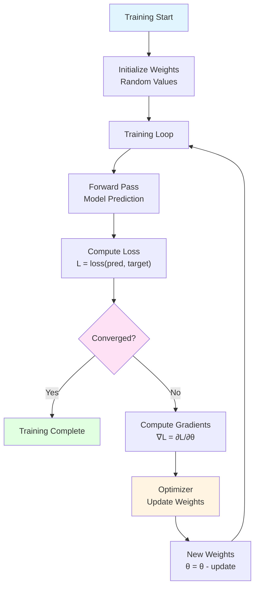
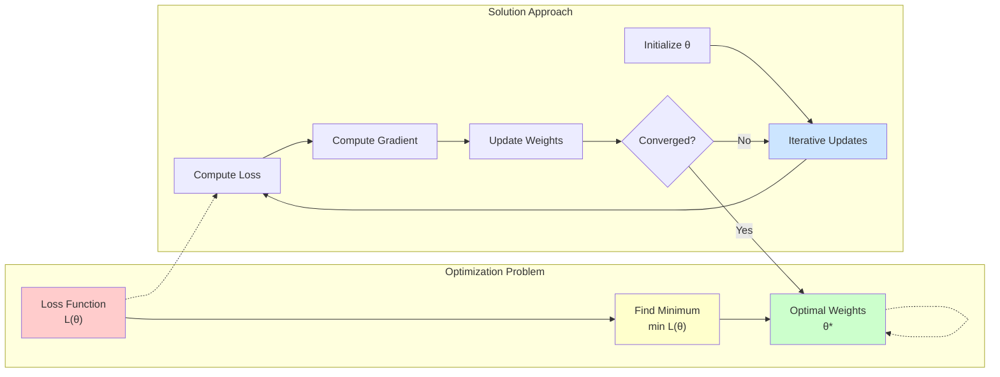
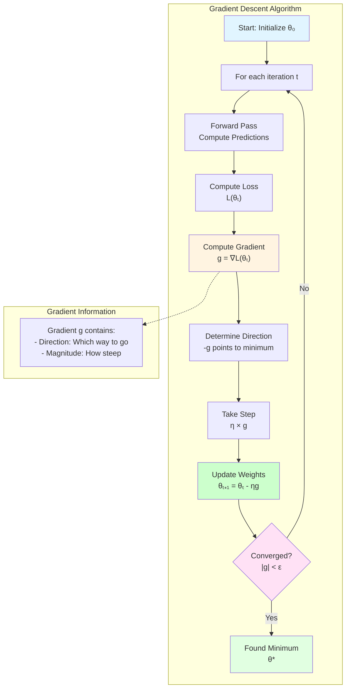
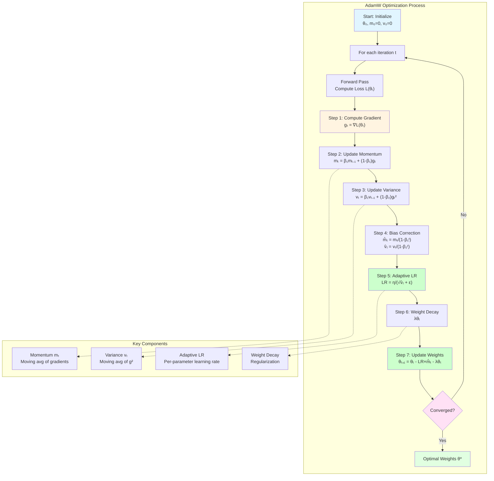
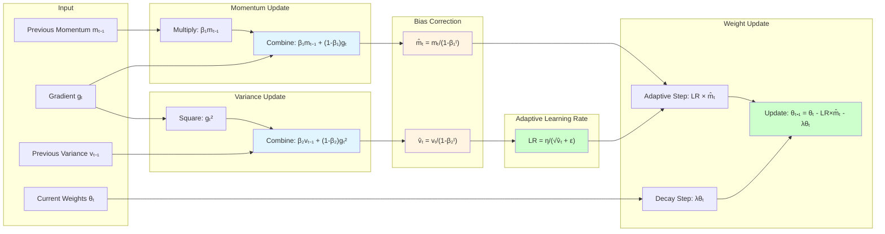
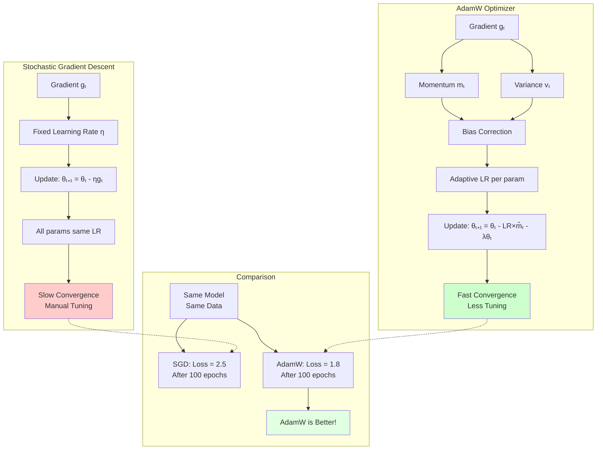
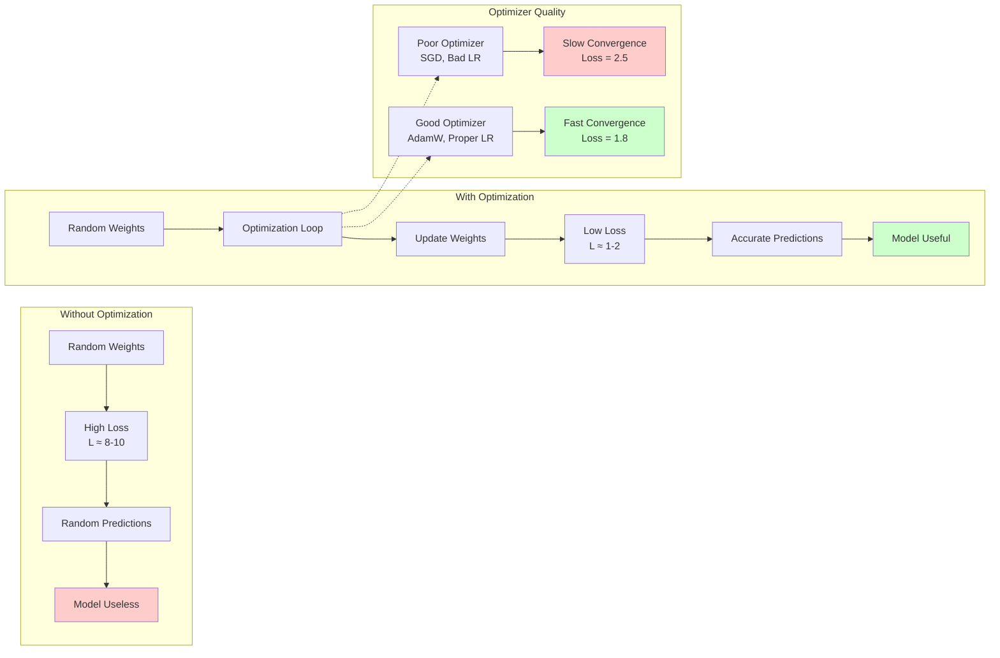
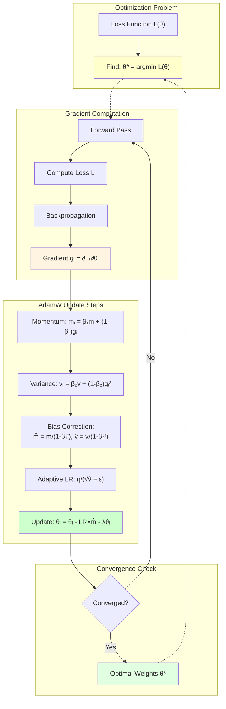
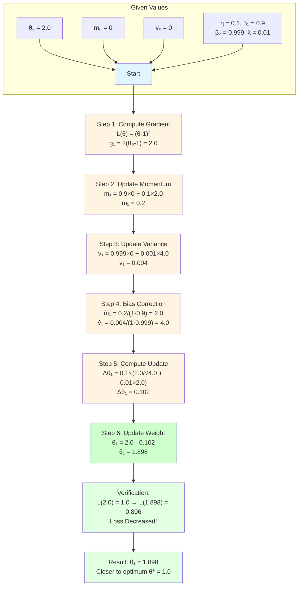

# What is Optimization? Step-by-Step Explanation

Complete step-by-step explanation of optimization in neural networks: how optimizers update weights to minimize loss.

## Table of Contents

1. [What is Optimization?](#71-what-is-optimization)
2. [The Optimization Problem](#72-the-optimization-problem)
3. [Gradient Descent](#73-gradient-descent)
4. [AdamW Optimizer](#74-adamw-optimizer)
5. [Why Optimization Matters](#75-why-optimization-matters)
6. [Complete Mathematical Formulation](#76-complete-mathematical-formulation)
7. [Exercise: Optimizer Step-by-Step](#77-exercise-optimizer-step-by-step)
8. [Key Takeaways](#78-key-takeaways)

---

## 7.1 What is Optimization?

### Simple Definition

**Optimization** is the process of finding the best set of weights (parameters) that minimize the loss function and make the model's predictions as accurate as possible.

### Visual Analogy

**Think of optimization like finding the lowest point in a valley:**

```
Loss Landscape:

    High Loss
        │
        │    ●  (current position)
        │   ╱│╲
        │  ╱ │ ╲
        │ ╱  │  ╲
        │╱   │   ╲
        │    ▼    │
        │   (goal)│
        │         │
    Low Loss ─────┘
```

**Goal:** Find the bottom of the valley (minimum loss)

**Optimizer:** Your guide down the mountain

### What Optimization Does

**Optimization:**
1. **Measures** how wrong the model is (loss)
2. **Calculates** direction to improve (gradients)
3. **Updates** weights to reduce loss
4. **Repeats** until convergence

**Result:** Model learns to make accurate predictions!

### Optimization Process Flow



---

## 7.2 The Optimization Problem

### The Objective

**We want to minimize:**

```math
L(\theta) = \frac{1}{N} \sum_{i=1}^{N} \ell(y_i, f(x_i; \theta))
```

**Where:**
- $\theta$ = all model parameters (weights)
- $L$ = total loss
- $\ell$ = loss function (e.g., cross-entropy)
- $y_i$ = correct answer
- $f(x_i; \theta)$ = model prediction
- $N$ = number of examples

### The Challenge

**Problem:** Loss function is complex and high-dimensional

**Solution:** Use iterative optimization algorithms

**Process:**
```
Initialize weights randomly
Repeat:
  1. Compute loss
  2. Compute gradients
  3. Update weights
Until convergence
```

### Optimization Problem Flowchart



---

## 7.3 Gradient Descent

### What is Gradient Descent?

**Gradient Descent** is a basic optimization algorithm that updates weights by moving in the direction of steepest descent.

### How It Works

**Step 1: Compute Gradient**

```math
\nabla_\theta L = \frac{\partial L}{\partial \theta}
```

**Gradient tells us:**
- Direction: Which way to go
- Magnitude: How steep the slope

**Step 2: Update Weights**

```math
\theta_{t+1} = \theta_t - \eta \nabla_\theta L
```

**Where:**
- $\theta_t$ = current weights
- $\eta$ = learning rate (step size)
- $\nabla_\theta L$ = gradient

**Meaning:** Move weights in direction opposite to gradient

### Visual Example

```
Loss Landscape (2D):

         Gradient
         Direction
            ↓
    ● ──────┼───── → Lower Loss
            │
            │
```

**Move in direction of negative gradient!**

### Gradient Descent Flowchart



### Types of Gradient Descent

**1. Batch Gradient Descent:**
- Uses all training examples
- Most accurate gradients
- Slow for large datasets

**2. Stochastic Gradient Descent (SGD):**
- Uses one example at a time
- Fast but noisy
- Can bounce around

**3. Mini-Batch Gradient Descent:**
- Uses small batch of examples
- Balance of speed and accuracy
- Most commonly used

### Gradient Descent Types Comparison

```mermaid
graph TB
    subgraph "Batch Gradient Descent"
        B1[All Training Data] --> B2[Compute Gradient<br/>on Full Dataset]
        B2 --> B3[Single Update<br/>Most Accurate]
        B3 --> B4["Slow: O(N)"]
    end
    
    subgraph "Stochastic Gradient Descent"
        S1[Single Example] --> S2[Compute Gradient<br/>on One Sample]
        S2 --> S3[Many Updates<br/>Fast but Noisy]
        S3 --> S4["Fast: O(1)"]
    end
    
    subgraph "Mini-Batch Gradient Descent"
        M1[Small Batch<br/>32-256 samples] --> M2[Compute Gradient<br/>on Batch]
        M2 --> M3[Balanced Updates<br/>Good Accuracy]
        M3 --> M4["Fast: O(batch_size)"]
    end
    
    style B3 fill:#ccffcc
    style S3 fill:#ffcccc
    style M3 fill:#fff4e1
```



---

## 7.4 AdamW Optimizer

### What is AdamW?

**AdamW** (Adam with Weight Decay) is an advanced optimizer that combines:
- **Adaptive learning rates** (like Adam)
- **Weight decay** (regularization)

**Why AdamW?**
- Per-parameter learning rates
- Handles sparse gradients well
- Works great for transformers

### How AdamW Works

**Step 1: Compute Gradient**

```math
g_t = \nabla_\theta L(\theta_t)
```

**Step 2: Update Momentum**

```math
m_t = \beta_1 m_{t-1} + (1 - \beta_1) g_t
```

**Where:**
- $\beta_1 = 0.9$ (momentum decay)
- $m_t$ = first moment estimate

**Meaning:** Moving average of gradients

**Step 3: Update Variance**

```math
v_t = \beta_2 v_{t-1} + (1 - \beta_2) g_t^2
```

**Where:**
- $\beta_2 = 0.999$ (variance decay)
- $v_t$ = second moment estimate

**Meaning:** Moving average of squared gradients

**Step 4: Bias Correction**

```math
\hat{m}_t = \frac{m_t}{1 - \beta_1^t}
```

```math
\hat{v}_t = \frac{v_t}{1 - \beta_2^t}
```

**Why?** Corrects bias in early iterations

**Step 5: Update Weights**

```math
\theta_{t+1} = \theta_t - \eta \left( \frac{\hat{m}_t}{\sqrt{\hat{v}_t} + \epsilon} + \lambda \theta_t \right)
```

**Where:**
- $\eta$ = learning rate
- $\epsilon = 10^{-8}$ (small constant)
- $\lambda$ = weight decay coefficient

**Key Points:**
- $\frac{\hat{m}_t}{\sqrt{\hat{v}_t}}$ = adaptive learning rate per parameter
- $\lambda \theta_t$ = weight decay (regularization)

### AdamW Optimizer Flowchart



### AdamW Detailed Subgraph



### Why AdamW is Better

**Compared to SGD:**

**SGD:**
```
Same learning rate for all parameters
→ Slow convergence
→ Manual tuning needed
```

**AdamW:**
```
Adaptive learning rate per parameter
→ Faster convergence
→ Less manual tuning
```

**Benefits:**
1. **Adaptive:** Each parameter gets its own learning rate
2. **Robust:** Works well with noisy gradients
3. **Efficient:** Converges faster than SGD
4. **Regularized:** Weight decay prevents overfitting

### SGD vs AdamW Comparison



---

## 7.5 Why Optimization Matters

### Reason 1: Without Optimization

**Random weights:**
```
Weights: Random values
Loss: Very high
Predictions: Random
Model: Useless
```

### Reason 2: With Optimization

**Learned weights:**
```
Weights: Optimized values
Loss: Low
Predictions: Accurate
Model: Useful
```

### Reason 3: Determines Learning Speed

**Good optimizer:**
- Fast convergence
- Stable training
- Good final performance

**Poor optimizer:**
- Slow convergence
- Unstable training
- Poor final performance

### Reason 4: Affects Final Performance

**Same model, different optimizers:**

```
SGD:      Loss = 2.5 (after 100 epochs)
AdamW:    Loss = 1.8 (after 100 epochs)
```

**Better optimizer = Better model!**

### Optimization Impact Visualization



---

## 7.6 Complete Mathematical Formulation

### Optimization Problem

```math
\theta^* = \arg\min_{\theta} L(\theta)
```

**Where $\theta^*$ is the optimal set of weights**

### Gradient Descent Update

```math
\theta_{t+1} = \theta_t - \eta \nabla_\theta L(\theta_t)
```

### AdamW Update (Complete)

**For each parameter $\theta_i$:**

**Gradient:**
```math
g_{t,i} = \frac{\partial L}{\partial \theta_{t,i}}
```

**Momentum:**
```math
m_{t,i} = \beta_1 m_{t-1,i} + (1 - \beta_1) g_{t,i}
```

**Variance:**
```math
v_{t,i} = \beta_2 v_{t-1,i} + (1 - \beta_2) g_{t,i}^2
```

**Bias Correction:**
```math
\hat{m}_{t,i} = \frac{m_{t,i}}{1 - \beta_1^t}
```

```math
\hat{v}_{t,i} = \frac{v_{t,i}}{1 - \beta_2^t}
```

**Update:**
```math
\theta_{t+1,i} = \theta_{t,i} - \eta \left( \frac{\hat{m}_{t,i}}{\sqrt{\hat{v}_{t,i}} + \epsilon} + \lambda \theta_{t,i} \right)
```

**Where:**
- $\beta_1 = 0.9$
- $\beta_2 = 0.999$
- $\epsilon = 10^{-8}$
- $\lambda$ = weight decay (e.g., 0.01)

### Complete Mathematical Flow



---

## 7.7 Exercise: Optimizer Step-by-Step

### Problem

**Given:**
- Current weight: $\theta_0 = 2.0$
- Loss function: $L(\theta) = (\theta - 1)^2$
- Learning rate: $\eta = 0.1$
- Use AdamW with $\beta_1 = 0.9$, $\beta_2 = 0.999$, $\lambda = 0.01$
- Initial moments: $m_0 = 0$, $v_0 = 0$

**Calculate the weight update for step 1.**

### Step-by-Step Solution

#### Step 1: Compute Gradient

**Loss function:**
```math
L(\theta) = (\theta - 1)^2
```

**Gradient:**
```math
g_1 = \frac{\partial L}{\partial \theta} = 2(\theta - 1)
```

**At $\theta_0 = 2.0$:**
```math
g_1 = 2(2.0 - 1) = 2(1.0) = 2.0
```

#### Step 2: Update Momentum

```math
m_1 = \beta_1 m_0 + (1 - \beta_1) g_1
```

```math
m_1 = 0.9 \times 0 + (1 - 0.9) \times 2.0 = 0 + 0.1 \times 2.0 = 0.2
```

#### Step 3: Update Variance

```math
v_1 = \beta_2 v_0 + (1 - \beta_2) g_1^2
```

```math
v_1 = 0.999 \times 0 + (1 - 0.999) \times (2.0)^2 = 0 + 0.001 \times 4.0 = 0.004
```

#### Step 4: Bias Correction

```math
\hat{m}_1 = \frac{m_1}{1 - \beta_1^1} = \frac{0.2}{1 - 0.9} = \frac{0.2}{0.1} = 2.0
```

```math
\hat{v}_1 = \frac{v_1}{1 - \beta_2^1} = \frac{0.004}{1 - 0.999} = \frac{0.004}{0.001} = 4.0
```

#### Step 5: Compute Update

```math
\Delta \theta_1 = \eta \left( \frac{\hat{m}_1}{\sqrt{\hat{v}_1} + \epsilon} + \lambda \theta_0 \right)
```

```math
\Delta \theta_1 = 0.1 \left( \frac{2.0}{\sqrt{4.0} + 10^{-8}} + 0.01 \times 2.0 \right)
```

```math
\Delta \theta_1 = 0.1 \left( \frac{2.0}{2.0 + 0.00000001} + 0.02 \right)
```

```math
\Delta \theta_1 = 0.1 \left( \frac{2.0}{2.0} + 0.02 \right) = 0.1 (1.0 + 0.02) = 0.1 \times 1.02 = 0.102
```

#### Step 6: Update Weight

```math
\theta_1 = \theta_0 - \Delta \theta_1 = 2.0 - 0.102 = 1.898
```

### Answer

**After one step:**
- Old weight: $\theta_0 = 2.0$
- New weight: $\theta_1 = 1.898$
- Update: $\Delta \theta_1 = -0.102$

**The weight moved closer to the optimal value (1.0)!**

### Verification

**Check loss:**
- Old loss: $L(2.0) = (2.0 - 1)^2 = 1.0$
- New loss: $L(1.898) = (1.898 - 1)^2 = 0.806$

**Loss decreased! ✓**

### Exercise Solution Flowchart



---

## 7.8 Key Takeaways

### Optimization

✅ **Optimization finds best weights to minimize loss**  
✅ **Uses gradients to determine update direction**  
✅ **Iterative process: compute → update → repeat**

### Gradient Descent

✅ **Basic algorithm: move opposite to gradient**  
✅ **Learning rate controls step size**  
✅ **Can be slow for complex problems**

### AdamW

✅ **Advanced optimizer with adaptive learning rates**  
✅ **Each parameter gets its own learning rate**  
✅ **Combines momentum and variance estimates**  
✅ **Includes weight decay for regularization**  
✅ **Works great for transformers**

### Why Important

✅ **Determines how fast model learns**  
✅ **Affects final model performance**  
✅ **Essential for training neural networks**

---

*This document provides a comprehensive explanation of optimization in neural networks, including gradient descent and AdamW optimizer with mathematical formulations and solved exercises.*

