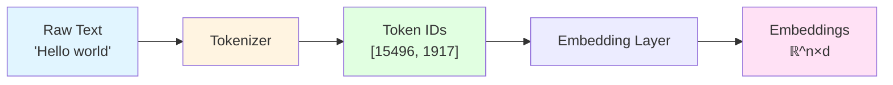
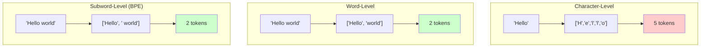
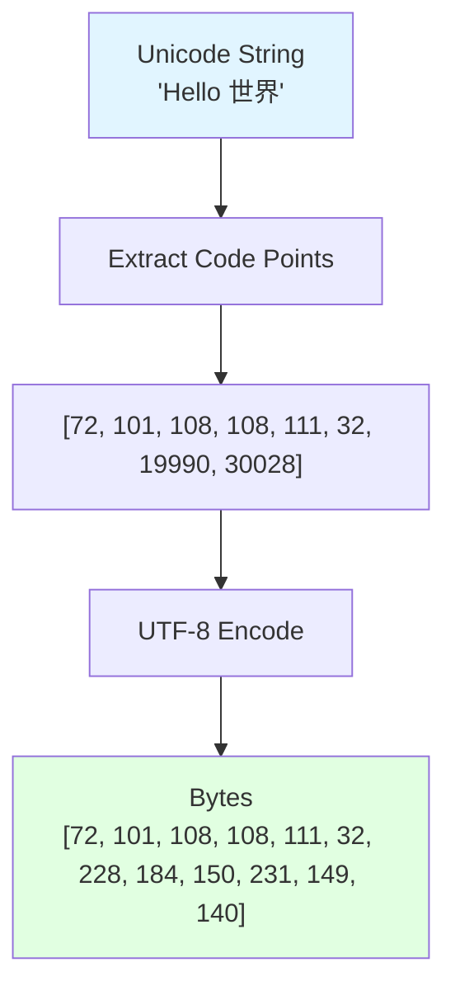
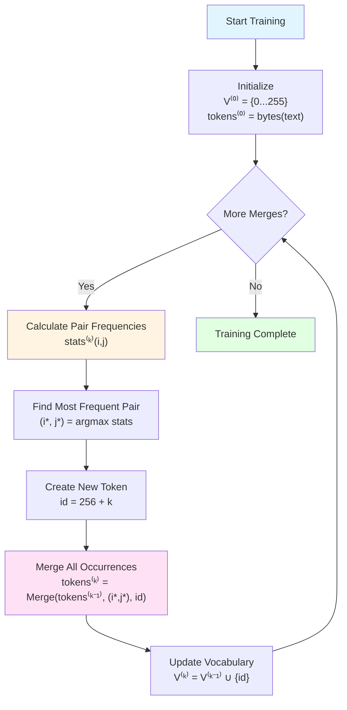
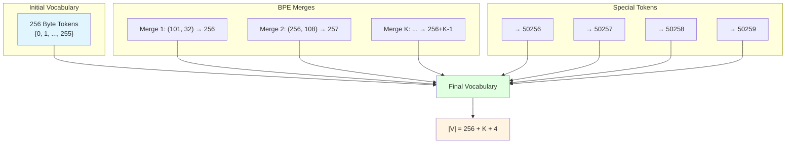
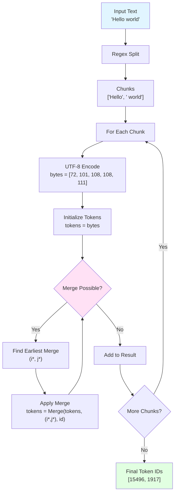
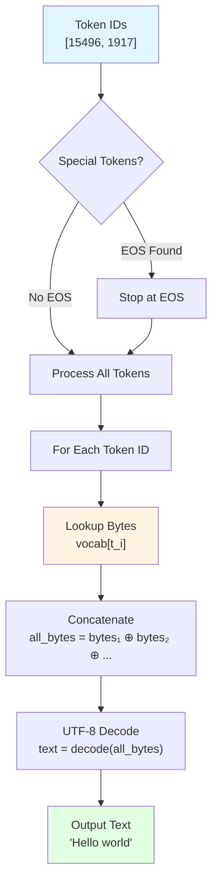
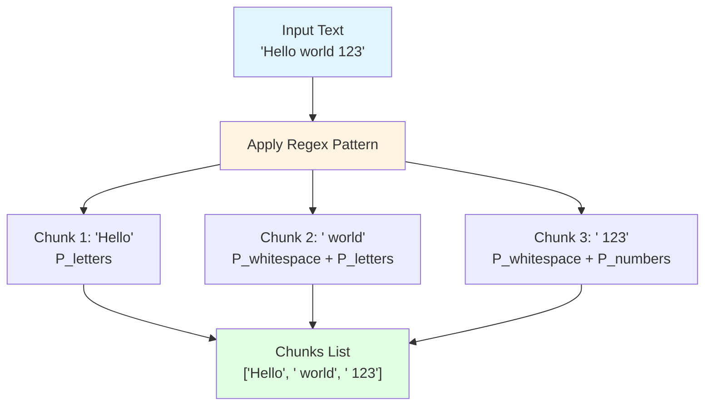
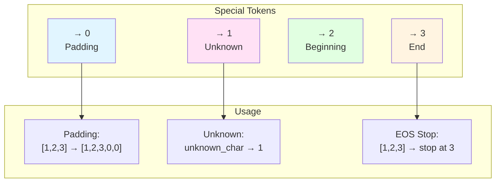
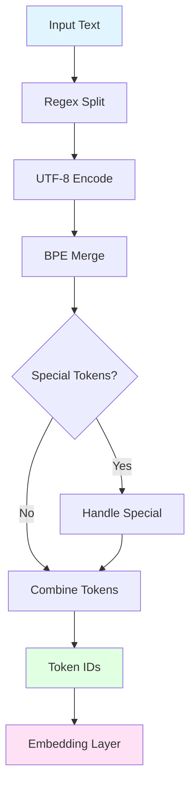

# Tokenization Explained - Mathematical Formulation

Complete mathematical derivation and step-by-step explanation of tokenization, Byte Pair Encoding (BPE), and UTF-8 encoding used in the SheepOp Language Model.

## Table of Contents

1. [Introduction to Tokenization](#1-introduction-to-tokenization)
2. [UTF-8 Encoding](#2-utf-8-encoding)
3. [Byte Pair Encoding Algorithm](#3-byte-pair-encoding-algorithm)
4. [Vocabulary Construction](#4-vocabulary-construction)
5. [Encoding Process](#5-encoding-process)
6. [Decoding Process](#6-decoding-process)
7. [Regex Pattern Splitting](#7-regex-pattern-splitting)
8. [Special Tokens](#8-special-tokens)
9. [Complete Tokenization Pipeline](#9-complete-tokenization-pipeline)
10. [Tokenization Challenges and Solutions](#10-tokenization-challenges-and-solutions)

---

## 1. Introduction to Tokenization

### 1.1 What is Tokenization?

**Tokenization** is the process of converting raw text into a sequence of discrete tokens (integers) that can be processed by neural networks.

**Mathematical Definition:**

Given a text string $s \in \Sigma^*$ where $\Sigma$ is the character alphabet, tokenization maps:

```math
\mathcal{T}: \Sigma^* \rightarrow \mathbb{N}^*
```

```math
s = c_1 c_2 \ldots c_n \mapsto \mathbf{t} = [t_1, t_2, \ldots, t_m]
```

where:

- $s$ = input text string
- $c_i$ = individual characters
- $\mathbf{t}$ = sequence of token IDs
- $n$ = number of characters
- $m$ = number of tokens (typically $m \leq n$)

### 1.2 Why Tokenization?

**Problem:** Neural networks require numerical inputs, not raw text.

**Solution:** Convert text to token sequences:



### 1.3 Tokenization Approaches

**Three Main Approaches:**

1. **Character-Level**: Each character becomes a token
   - Vocabulary size: ~100-200
   - Sequence length: Very long

2. **Word-Level**: Each word becomes a token
   - Vocabulary size: ~50,000-100,000
   - Sequence length: Moderate

3. **Subword-Level (BPE)**: Sequences of bytes/characters become tokens
   - Vocabulary size: ~30,000-100,000
   - Sequence length: Efficient



---

## 2. UTF-8 Encoding

### 2.1 Unicode Code Points

**Unicode** defines a mapping from characters to integers (code points):

```math
f: \mathcal{C} \rightarrow \{0, 1, \ldots, 0x10FFFF\}
```

where $\mathcal{C}$ is the set of all Unicode characters.

**Example:**

```math
f('H') = 72, \quad f('ε') = 949, \quad f('中') = 20013
```

### 2.2 UTF-8 Encoding Function

**UTF-8** encodes Unicode code points into variable-length byte sequences:

```math
\text{UTF-8}: \{0, \ldots, 0x10FFFF\} \rightarrow \{0, \ldots, 255\}^*
```

**Encoding Rules:**

For a code point $c$:

```math
\text{UTF-8}(c) = \begin{cases}
[b_0] & \text{if } c < 128 \\
[b_0, b_1] & \text{if } c < 2048 \\
[b_0, b_1, b_2] & \text{if } c < 65536 \\
[b_0, b_1, b_2, b_3] & \text{if } c < 0x10FFFF
\end{cases}
```

where $b_i \in \{0, \ldots, 255\}$ are bytes.

### 2.3 UTF-8 Encoding Process



**Mathematical Formulation:**

For a string $s = c_1 c_2 \ldots c_n$:

```math
\text{bytes}(s) = \bigoplus_{i=1}^n \text{UTF-8}(f(c_i))
```

where $\bigoplus$ denotes byte concatenation.

**Example:**

```math
\text{bytes}("Hi") = \text{UTF-8}(72) \oplus \text{UTF-8}(105) = [72] \oplus [105] = [72, 105]
```

---

## 3. Byte Pair Encoding Algorithm

### 3.1 BPE Overview

**Byte Pair Encoding (BPE)** is a data compression algorithm that iteratively merges the most frequent consecutive pairs.

**Goal:** Create an efficient vocabulary by merging frequent byte/character pairs.

### 3.2 BPE Training Algorithm

**Initial State:**

```math
V^{(0)} = \{0, 1, \ldots, 255\} \quad \text{(all bytes)}
```

```math
\text{tokens}^{(0)} = \text{bytes}(s) = [b_1, b_2, \ldots, b_n]
```

**Iterative Merging:**

For iteration $k = 1, 2, \ldots, K$:

**Step 1: Calculate Pair Frequencies**

```math
\text{stats}^{(k)} = \text{CountPairs}(\text{tokens}^{(k-1)})
```

```math
\text{stats}^{(k)}(i, j) = |\{p : \text{tokens}^{(k-1)}_p = i \land \text{tokens}^{(k-1)}_{p+1} = j\}|
```

**Step 2: Find Most Frequent Pair**

```math
(i^*, j^*) = \arg\max_{(i,j)} \text{stats}^{(k)}(i, j)
```

**Step 3: Create New Token**

```math
V^{(k)} = V^{(k-1)} \cup \{256 + k - 1\}
```

```math
\text{merges}^{(k)} = \text{merges}^{(k-1)} \cup \{(i^*, j^*) \mapsto 256 + k - 1\}
```

**Step 4: Apply Merge**

```math
\text{tokens}^{(k)} = \text{Merge}(\text{tokens}^{(k-1)}, (i^*, j^*), 256 + k - 1)
```

where:

```math
\text{Merge}(T, (a, b), \text{new\_id})_i = \begin{cases}
\text{new\_id} & \text{if } T_i = a \land T_{i+1} = b \\
T_i & \text{otherwise}
\end{cases}
```

### 3.3 BPE Training Flowchart



### 3.4 BPE Example

**Example:** Training on text "aaab"

**Iteration 0:**

```math
V^{(0)} = \{0, 1, \ldots, 255\}
```

```math
\text{tokens}^{(0)} = [97, 97, 97, 98] \quad \text{(bytes for 'aaab')}
```

**Calculate frequencies:**

```math
\text{stats}^{(0)} = \{(97, 97): 2, (97, 98): 1\}
```

**Iteration 1:**

```math
(i^*, j^*) = (97, 97), \quad \text{new\_id} = 256
```

```math
\text{tokens}^{(1)} = [256, 97, 98]
```

```math
V^{(1)} = V^{(0)} \cup \{256\}
```

**Iteration 2:**

```math
\text{stats}^{(1)} = \{(256, 97): 1, (97, 98): 1\}
```

**Choose one:** \((256, 97)\), \(\text{new_id} = 257\)

```math
\text{tokens}^{(2)} = [257, 98]
```

---

## 4. Vocabulary Construction

### 4.1 Vocabulary Structure

**Final Vocabulary:**

```math
V = V_{\text{bytes}} \cup V_{\text{merges}} \cup V_{\text{special}}
```

where:

- $V_{\text{bytes}} = \{0, 1, \ldots, 255\}$ (256 tokens)
- $V_{\text{merges}} = \{256, 257, \ldots, 256 + K - 1\}$ (K merged tokens)
- $V_{\text{special}} = \{\text{<pad>}, \text{<unk>}, \text{<bos>}, \text{<eos>}\}$

**Vocabulary Size:**

```math
|V| = 256 + K + |V_{\text{special}}|
```

### 4.2 Merge Dictionary

**Merge Dictionary:**

```math
M: \mathbb{N} \times \mathbb{N} \rightarrow \mathbb{N}
```

```math
M(i, j) = \begin{cases}
\text{merged\_id} & \text{if } (i, j) \text{ was merged} \\
\text{undefined} & \text{otherwise}
\end{cases}
```

**Vocabulary Mapping:**

```math
\text{vocab}: \mathbb{N} \rightarrow \{0, \ldots, 255\}^*
```

```math
\text{vocab}(\text{id}) = \begin{cases}
[\text{id}] & \text{if } \text{id} < 256 \\
\text{vocab}(i) \oplus \text{vocab}(j) & \text{if } M(i, j) = \text{id}
\end{cases}
```

### 4.3 Vocabulary Construction Diagram



---

## 5. Encoding Process

### 5.1 Encoding Algorithm

**Input:** Text string $s$

**Step 1: Regex Splitting**

```math
\text{chunks} = \text{RegexSplit}(s, \text{pattern})
```

**Step 2: Convert to Bytes**

For each chunk $c \in \text{chunks}$:

```math
\text{bytes}(c) = \text{UTF-8}(c) = [b_1, b_2, \ldots, b_n]
```

**Step 3: Apply BPE Merges**

Initialize: $\text{tokens} = \text{bytes}(c)$

While merges possible:

```math
\text{Find earliest merge: } (i^*, j^*) = \arg\min_{(i,j) \in M} \text{merge\_index}(M(i, j))
```

```math
\text{Apply merge: } \text{tokens} = \text{Merge}(\text{tokens}, (i^*, j^*), M(i^*, j^*))
```

**Step 4: Combine Results**

```math
\text{token\_ids} = \bigoplus_{c \in \text{chunks}} \text{BPE}(\text{bytes}(c))
```

### 5.2 Encoding Function

**Mathematical Definition:**

```math
\text{encode}(s) = \bigoplus_{c \in \text{RegexSplit}(s)} \text{BPE}(\text{UTF-8}(c))
```

where $\bigoplus$ denotes token sequence concatenation.

### 5.3 Encoding Flowchart



### 5.4 Encoding Example

**Input:** "Hello world"

**Step 1: Regex Split**

```math
\text{chunks} = ["Hello", " world"]
```

**Step 2: UTF-8 Encoding**

```math
\text{UTF-8}("Hello") = [72, 101, 108, 108, 111]
```

```math
\text{UTF-8}(" world") = [32, 119, 111, 114, 108, 100]
```

**Step 3: BPE Merging**

Assume merges: $M(72, 101) = 256, M(256, 108) = 257, M(257, 108) = 258, M(258, 111) = 259$

```math
[72, 101, 108, 108, 111] \xrightarrow{M(72,101)} [256, 108, 108, 111]
```

```math
\xrightarrow{M(256,108)} [257, 108, 111] \xrightarrow{M(257,108)} [258, 111]
```

```math
\xrightarrow{M(258,111)} [259]
```

**Final:** $[259, 1917]$

---

## 6. Decoding Process

### 6.1 Decoding Algorithm

**Input:** Token IDs $\mathbf{t} = [t_1, t_2, \ldots, t_n]$

**Step 1: Handle Special Tokens**

```math
\text{Stop at EOS: } \mathbf{t}' = \mathbf{t}[:i] \text{ where } t_i = \text{<eos>}
```

**Step 2: Lookup Bytes**

For each token $t_i$:

```math
\text{bytes}_i = \text{vocab}(t_i)
```

**Step 3: Concatenate Bytes**

```math
\text{all\_bytes} = \bigoplus_{i=1}^n \text{bytes}_i
```

**Step 4: UTF-8 Decode**

```math
\text{text} = \text{UTF-8}^{-1}(\text{all\_bytes})
```

### 6.2 Decoding Function

**Mathematical Definition:**

```math
\text{decode}(\mathbf{t}) = \text{UTF-8}^{-1}\left(\bigoplus_{i=1}^n \text{vocab}(t_i)\right)
```

### 6.3 Decoding Flowchart



### 6.4 Decoding Example

**Input:** $[259, 1917]$

**Step 1: Lookup**

```math
\text{vocab}(259) = \text{vocab}(258) \oplus \text{vocab}(111)
```

```math
= (\text{vocab}(257) \oplus \text{vocab}(108)) \oplus [111]
```

```math
= ((\text{vocab}(256) \oplus \text{vocab}(108)) \oplus [108]) \oplus [111]
```

```math
= (((\text{vocab}(72) \oplus \text{vocab}(101)) \oplus [108]) \oplus [108]) \oplus [111]
```

```math
= [[72] \oplus [101]] \oplus [108] \oplus [108] \oplus [111]
```

```math
= [72, 101, 108, 108, 111]
```

```math
\text{vocab}(1917) = [32, 119, 111, 114, 108, 100]
```

**Step 2: Concatenate**

```math
\text{all\_bytes} = [72, 101, 108, 108, 111] \oplus [32, 119, 111, 114, 108, 100]
```

```math
= [72, 101, 108, 108, 111, 32, 119, 111, 114, 108, 100]
```

**Step 3: Decode**

```math
\text{decode}([72, 101, 108, 108, 111, 32, 119, 111, 114, 108, 100]) = "Hello world"
```

---

## 7. Regex Pattern Splitting

### 7.1 GPT-4 Style Pattern

**Pattern Components:**

```math
P = P_{\text{contractions}} \cup P_{\text{letters}} \cup P_{\text{numbers}} \cup P_{\text{punctuation}} \cup P_{\text{whitespace}}
```

**Pattern Definition:**

\[
P = \text{'(?i:[sdmt]|ll|ve|re)} \cup \text{[^\r\n\p{L}\p{N}]?+\p{L}+} \cup \text{\p{N}{1,3}} \cup \text{?[^\s\p{L}\p{N}]++} \cup \text{\r?\n} \cup \text{\s+}
\]

**Components:**

1. **Contractions:** \( P\_{\text{contractions}} = \text{'(?i:[sdmt]|ll|ve|re)} \)
   - Matches: `'s`, `'t`, `'ll`, `'ve`, `'re` (case-insensitive)

2. **Letters:** \( P\_{\text{letters}} = \text{[^\r\n\p{L}\p{N}]?+\p{L}+} \)
   - Optional space + one or more letters

3. **Numbers:** \( P\_{\text{numbers}} = \text{\p{N}{1,3}} \)
   - **Limit:** 1-3 digits only (prevents long number tokens)

4. **Punctuation:** \( P\_{\text{punctuation}} = \text{?[^\s\p{L}\p{N}]++} \)
   - Optional space + punctuation

5. **Whitespace:** \( P\_{\text{whitespace}} = \text{\r?\n} \cup \text{\s+} \)
   - Newlines and multiple spaces

### 7.2 Regex Splitting Function

```math
\text{RegexSplit}(s, P) = \{m_1, m_2, \ldots, m_k : m_i \in \text{Match}(s, P)\}
```

where matches are found left-to-right, non-overlapping.

### 7.3 Regex Splitting Diagram



**Example:**

```math
\text{RegexSplit}("Hello world 123", P) = ["Hello", " world", " 123"]
```

---

## 8. Special Tokens

### 8.1 Special Token Set

**Special Tokens:**

```math
V_{\text{special}} = \{\text{<pad>}, \text{<unk>}, \text{<bos>}, \text{<eos>}\}
```

**Token IDs:**

```math
\text{id}(\text{<pad>}) = 0, \quad \text{id}(\text{<unk>}) = 1, \quad \text{id}(\text{<bos>}) = 2, \quad \text{id}(\text{<eos>}) = 3
```

### 8.2 Special Token Functions

**Padding:**

```math
\text{pad}(\mathbf{t}, \text{max\_length}) = \mathbf{t} \oplus [\text{<pad>}]^{\max(\text{max\_length} - |\mathbf{t}|, 0)}
```

**Unknown Token:**

```math
\text{encode}(s) = \begin{cases}
[\text{id}(c)] & \text{if } c \in V \\
[\text{<unk>}] & \text{if } c \notin V
\end{cases}
```

**EOS Handling:**

```math
\text{decode}(\mathbf{t}) = \text{decode}(\mathbf{t}[:i]) \text{ where } t_i = \text{<eos>}
```

### 8.3 Special Token Flowchart



---

## 9. Complete Tokenization Pipeline

### 9.1 Full Pipeline

**Complete Tokenization Process:**



### 9.2 Mathematical Formulation

**Complete Encoding:**

```math
\text{Tokenize}(s) = \text{HandleSpecial}\left(\bigoplus_{c \in \text{RegexSplit}(s)} \text{BPE}(\text{UTF-8}(c))\right)
```

**Complete Decoding:**

```math
\text{Detokenize}(\mathbf{t}) = \text{UTF-8}^{-1}\left(\bigoplus_{i=1}^n \text{vocab}(\text{RemoveSpecial}(t_i))\right)
```

### 9.3 Pipeline Example

**Input:** "Hello world!"

**Step 1: Regex Split**

```math
\text{chunks} = ["Hello", " world", "!"]
```

**Step 2: UTF-8 Encode**

```math
\text{bytes} = [[72,101,108,108,111], [32,119,111,114,108,100], [33]]
```

**Step 3: BPE Merge**

```math
\text{tokens} = [[15496], [1917], [0]]
```

**Step 4: Combine**

```math
\text{final} = [15496, 1917, 0]
```

---

## 10. Tokenization Challenges and Solutions

### 10.1 Challenge: Long Tokens

**Problem:** Some tokens become very long (e.g., "defaultstyle" as single token).

**Mathematical Impact:**

```math
\text{LongToken}(s) = \begin{cases}
1 \text{ token} & \text{if } |s| > 10 \text{ chars} \\
\text{multiple tokens} & \text{otherwise}
\end{cases}
```

**Solution:** Better regex splitting prevents over-merging.

### 10.2 Challenge: Number Tokenization

**Problem:** Numbers tokenized arbitrarily (sometimes 1 token, sometimes 2-3).

**Solution:** Limit number merging to 1-3 digits:

```math
P_{\text{numbers}} = \text{\p{N}{1,3}}
```

**Impact:**

```math
\text{TokenCount}(n) = \begin{cases}
1 & \text{if } n < 1000 \\
2-3 & \text{if } n \geq 1000
\end{cases}
```

### 10.3 Challenge: Python Code Efficiency

**Problem:** Each space is separate token (GPT-2 issue).

**Solution:** Merge multiple spaces:

```math
P_{\text{whitespace}} = \text{\s+} \quad \text{(matches multiple spaces)}
```

**Efficiency Gain:**

```math
\text{TokensBefore} = |\text{spaces}| \quad \text{(one token per space)}
```

```math
\text{TokensAfter} = \lceil |\text{spaces}| / 4 \rceil \quad \text{(grouped spaces)}
```

### 10.4 Challenge: Trailing Whitespace

**Problem:** Trailing spaces cause poor tokenization.

**Detection:**

```math
\text{HasTrailingSpace}(s) = \begin{cases}
\text{True} & \text{if } s[-1] = ' ' \\
\text{False} & \text{otherwise}
\end{cases}
```

**Warning:**

```math
\text{Tokenize}(s) = \begin{cases}
\text{encode}(s) + \text{warning} & \text{if } \text{HasTrailingSpace}(s) \\
\text{encode}(s) & \text{otherwise}
\end{cases}
```

### 10.5 Challenge: Multilingual Support

**Problem:** Non-English languages tokenize inefficiently.

**Solution:** UTF-8 byte-level encoding handles all languages:

```math
\text{Tokenize}(s) = \text{BPE}(\text{UTF-8}(s)) \quad \forall s \in \Sigma^*
```

**Efficiency:**

```math
\text{TokenRatio} = \frac{|\text{Tokenize}(s_{\text{non-english}})|}{|\text{Tokenize}(s_{\text{english}})|} \approx 1.5-2.0
```

### 10.6 Challenge: Untrained Tokens

**Problem:** Some tokens never appear in training data.

**Solution:** Fallback handling:

```math
\text{Decode}(t) = \begin{cases}
\text{vocab}(t) & \text{if } t \in V \\
\text{<unk>} & \text{if } t \notin V \\
\text{fallback\_bytes} & \text{if } t < 256
\end{cases}
```

---

## Summary

### Key Formulas

**Encoding:**

```math
\text{encode}(s) = \text{HandleSpecial}\left(\bigoplus_{c \in \text{RegexSplit}(s)} \text{BPE}(\text{UTF-8}(c))\right)
```

**Decoding:**

```math
\text{decode}(\mathbf{t}) = \text{UTF-8}^{-1}\left(\bigoplus_{i=1}^n \text{vocab}(t_i)\right)
```

**BPE Merge:**

```math
\text{tokens}^{(k)} = \text{Merge}(\text{tokens}^{(k-1)}, \arg\max_{(i,j)} \text{stats}^{(k)}(i,j), 256+k-1)
```

**Vocabulary Size:**

```math
|V| = 256 + K + |V_{\text{special}}|
```

### Key Takeaways

1. **UTF-8 Encoding**: Handles all Unicode characters consistently
2. **BPE Algorithm**: Creates efficient vocabulary through iterative merging
3. **Regex Splitting**: Prevents over-merging with pattern-based chunking
4. **Special Tokens**: Control flow and handle edge cases
5. **Byte-Level**: Works at byte level for universal language support
