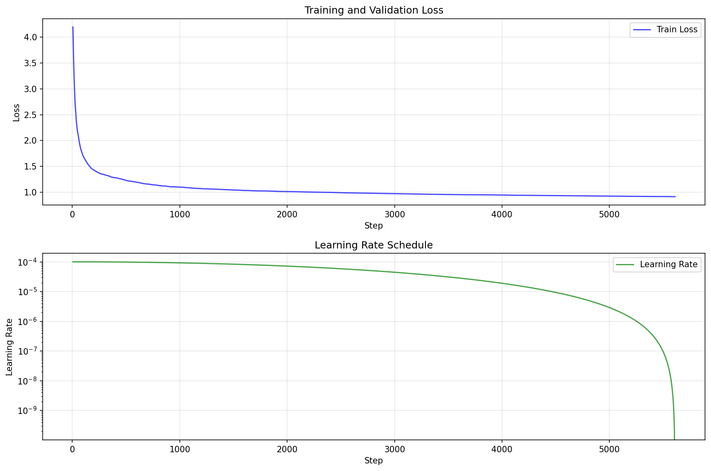
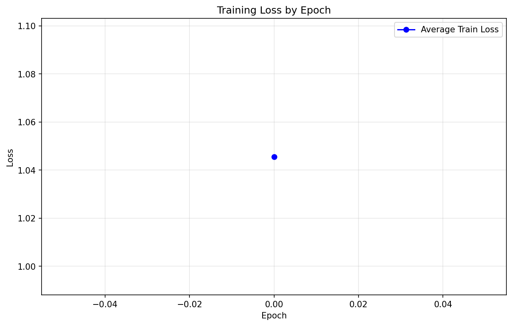

# What is Training? Step-by-Step Explanation

Complete step-by-step explanation of model training: what it is, why we need data, why more data is better, and how the model learns.

## Table of Contents

1. [What is Training?](#51-what-is-training)
2. [Why Do We Need Training?](#52-why-do-we-need-training)
3. [What Does the Model Learn?](#53-what-does-the-model-learn)
4. [Why Do We Need Data?](#54-why-do-we-need-data)
5. [Why More Data is Better](#55-why-more-data-is-better)
6. [How Training Works: Step-by-Step](#56-how-training-works-step-by-step)
7. [The Training Process](#57-the-training-process)
8. [Loss Function](#58-loss-function)
9. [Optimization](#59-optimization)
10. [Evaluation](#510-evaluation)
11. [Common Questions](#511-common-questions)
12. [Training Metrics and Artifacts](#512-training-metrics-and-artifacts)

---

## 5.1 What is Training?

### Simple Definition

**Training** is the process of teaching a neural network to make predictions by showing it examples and adjusting its parameters to minimize errors.

### The Learning Analogy

**Think of training like teaching a child:**

**Child Learning:**

- You show examples: "This is a cat", "This is a dog"
- Child makes mistakes: Calls a cat "dog"
- You correct: "No, that's a cat"
- Child learns patterns from many examples
- Eventually, child recognizes cats and dogs correctly

**Model Training:**

- You show examples: "Hello" → next word "World"
- Model makes predictions: "Hello" → predicts "Hi"
- You compute error: Compare prediction to actual
- Model adjusts: Updates parameters to reduce error
- Process repeats: Shows many examples
- Eventually, model learns to predict correctly

### What Happens During Training?

**The model:**

1. **Sees** input data (examples)
2. **Makes** predictions
3. **Compares** predictions to correct answers
4. **Calculates** how wrong it was (loss)
5. **Adjusts** parameters to be less wrong
6. **Repeats** millions of times

**Result:** A model that can make accurate predictions!

---

## 5.2 Why Do We Need Training?

### The Problem

**Untrained models are random:**

**Initial State:**

```
Input: "Hello"
Model Prediction: Random guess
→ "apple" (30%)
→ "zebra" (25%)
→ "World" (5%)
→ Other random words...
```

**The model doesn't know anything yet!**

### The Solution: Training

**After Training:**

```
Input: "Hello"
Model Prediction: Learned pattern
→ "World" (85%)
→ "there" (8%)
→ "friend" (3%)
→ Other reasonable words...
```

**The model learned language patterns!**

### Why Training is Essential

**Without Training:**

- Random predictions
- No understanding of language
- No useful output
- Model is useless

**With Training:**

- Learned patterns
- Understanding of language
- Useful predictions
- Model is valuable

---

## 5.3 What Does the Model Learn?

### 1. Language Patterns

**Learns:**

- Word relationships ("Hello" often followed by "World")
- Grammar rules (subject-verb agreement)
- Sentence structure (nouns, verbs, adjectives)
- Context understanding (same word means different things)

**Example:**

```
"You" → "are" (learned: pronoun + verb agreement)
"The cat" → "sat" (learned: noun + verb)
"Machine learning" → "is" (learned: compound noun + verb)
```

### 2. Semantic Relationships

**Learns:**

- Similar words have similar meanings
- Related concepts cluster together
- Word embeddings capture meaning
- Context determines word usage

**Example:**

```
"cat" and "dog" → Similar embeddings (both animals)
"king" - "man" + "woman" ≈ "queen" (learned relationships)
```

### 3. Sequential Patterns

**Learns:**

- Predict next token based on context
- Long-range dependencies
- Common phrases and idioms
- Writing style and tone

**Example:**

```
"Once upon a time" → "there" (learned: story beginning)
"The quick brown fox" → "jumps" (learned: common phrase)
```

### 4. Statistical Patterns

**Learns:**

- How often words appear together
- Probability distributions over vocabulary
- Language statistics
- Common word sequences

**Example:**

```
"The" → very common (appears frequently)
"Antidisestablishmentarianism" → rare (appears rarely)
```

---

## 5.4 Why Do We Need Data?

### The Fundamental Need

**Models learn from examples, not from rules:**

**Rule-Based Approach (Old Way):**

```
Programmer writes rules:
IF word == "Hello" THEN next_word = "World"
IF word == "The" THEN next_word = "cat"
...
```

**Problems:**

- Need to write millions of rules
- Can't capture all patterns
- Brittle and breaks easily
- Doesn't generalize

**Data-Driven Approach (Modern Way):**

```
Model learns from examples:
"Hello World" (example 1)
"The cat sat" (example 2)
...
```

**Benefits:**

- Automatically learns patterns
- Captures complex relationships
- Generalizes to new examples
- Handles ambiguity

### Why Data is Essential

**Data provides:**

**1. Examples to Learn From**

```
Without data: Model has no examples
With data: Model sees millions of examples
```

**2. Ground Truth**

```
Without data: No correct answers
With data: Knows what correct predictions are
```

**3. Patterns to Discover**

```
Without data: Can't find patterns
With data: Discovers language patterns automatically
```

**4. Evaluation**

```
Without data: Can't measure performance
With data: Can test if model learned correctly
```

### What Data Provides

**Training Data:**

- Input-output pairs
- Examples to learn from
- Patterns to discover
- Ground truth for comparison

**Example:**

```
Input:  "Hello"
Output: "World"

Input:  "Machine learning"
Output: "is"

Input:  "The cat"
Output: "sat"
```

**Each example teaches the model something!**

---

## 5.5 Why More Data is Better

### The Relationship Between Data and Performance

**General Rule:**

```
More Data → Better Performance
```

**But why?**

### Reason 1: More Patterns

**Little Data:**

```
100 examples:
- See "Hello World" once
- See "Hello there" once
- Model uncertain: Which is more common?
```

**More Data:**

```
1,000,000 examples:
- See "Hello World" 500,000 times
- See "Hello there" 200,000 times
- See "Hello friend" 300,000 times
- Model confident: "Hello World" is most common
```

**More examples = Better pattern recognition**

### Reason 2: Broader Coverage

**Little Data:**

```
Limited vocabulary:
- Only sees common words
- Misses rare words
- Poor generalization
```

**More Data:**

```
Comprehensive vocabulary:
- Sees common words frequently
- Sees rare words occasionally
- Good generalization
```

**More examples = Better coverage**

### Reason 3: Better Generalization

**Little Data:**

```
Sees: "The cat sat on the mat"
Learns: Exact pattern
Test: "The dog sat on the rug"
Fails: Never saw "dog" or "rug"
```

**More Data:**

```
Sees: Many variations
- "The cat sat on the mat"
- "The dog sat on the rug"
- "The bird sat on the branch"
Learns: General pattern
Test: "The dog sat on the rug"
Succeeds: Understands pattern
```

**More examples = Better generalization**

### Reason 4: Reduces Overfitting

**Little Data:**

```
Model memorizes examples:
- Perfect on training data
- Poor on new data
- Overfitting!
```

**More Data:**

```
Model learns patterns:
- Good on training data
- Good on new data
- Generalizes well!
```

**More examples = Less overfitting**

### Reason 5: Statistical Confidence

**Little Data:**

```
10 examples of "Hello World"
→ Statistically uncertain
→ High variance in predictions
```

**More Data:**

```
1,000,000 examples of "Hello World"
→ Statistically confident
→ Low variance in predictions
```

**More examples = More confident predictions**

### The Data-Performance Curve

```
Performance
    │
100%│                              ●───── (More data needed)
    │                      ●─────
    │              ●─────
    │        ●─────
    │  ●─────
    │
  0%├───────────────────────────────────── Data
    0    1K   10K  100K  1M   10M  100M
```

**Diminishing Returns:**

- First 1M examples: Huge improvement
- Next 9M examples: Good improvement
- Next 90M examples: Smaller improvement
- Beyond: Very small improvements

**But more data is almost always better!**

### Real-World Examples

**GPT-3:**

- Trained on ~300 billion tokens
- Requires massive datasets
- Better performance with more data

**Our Model:**

- Can train on any amount of data
- More data = better performance
- Scales with dataset size

---

## 5.6 How Training Works: Step-by-Step

### High-Level Overview

```
1. Initialize model (random weights)
2. For each epoch:
   a. For each batch:
      - Forward pass (make predictions)
      - Compute loss (measure error)
      - Backward pass (compute gradients)
      - Update weights (reduce error)
3. Evaluate model
4. Repeat until convergence
```

### Detailed Step-by-Step

#### Step 1: Initialize Model

**Start with random weights:**

```
Embedding weights: Random values
Attention weights: Random values
FFN weights: Random values
→ Model makes random predictions
```

**Example:**

```
Weight initialization: [-0.1, 0.05, 0.2, ...] (random)
Initial prediction: Random token (meaningless)
```

#### Step 2: Forward Pass

**Process input through model:**

```
Input: "Hello"
    ↓
Embedding: [0.1, -0.2, 0.3, ...]
    ↓
Attention: [0.15, 0.08, 0.22, ...]
    ↓
FFN: [0.18, -0.12, 0.24, ...]
    ↓
Output: [logits for all tokens]
    ↓
Prediction: "apple" (highest logit)
```

#### Step 3: Compute Loss

**Compare prediction to correct answer:**

```
Expected: "World"
Predicted: "apple"
Loss: High (wrong prediction)
```

**Loss Function (Cross-Entropy):**

```
Loss = -log(P(predicted = correct))
```

**Example:**

```
Correct token: "World" (ID 87)
Predicted probability: 0.05 (5%)
Loss = -log(0.05) ≈ 2.996 (high loss)
```

#### Step 4: Backward Pass

**Compute gradients:**

```
Loss: 2.996
    ↓
Compute gradients: ∂Loss/∂weights
    ↓
Gradients: [0.5, -0.3, 0.8, ...]
    ↓
Shows direction to reduce loss
```

**Meaning:** Gradients tell us how to adjust weights to reduce error

#### Step 5: Update Weights

**Adjust weights using optimizer:**

```
Current weights: [0.1, -0.2, 0.3, ...]
Gradients: [0.5, -0.3, 0.8, ...]
Learning rate: 0.0001

New weights = Old weights - Learning rate × Gradients
            = [0.1, -0.2, 0.3, ...] - 0.0001 × [0.5, -0.3, 0.8, ...]
            = [0.09995, -0.19997, 0.29992, ...]
```

**Result:** Weights slightly adjusted to reduce loss

#### Step 6: Repeat

**Process repeats for millions of examples:**

```
Batch 1: Update weights slightly
Batch 2: Update weights slightly
Batch 3: Update weights slightly
...
Batch 1,000,000: Update weights slightly

Result: Cumulative improvements → Model learns!
```

---

## 5.7 The Training Process

### Complete Training Loop

**For each epoch:**

```
Epoch 1:
  Batch 1: [Input: "Hello", Output: "World"] → Loss: 2.996 → Update
  Batch 2: [Input: "Machine", Output: "learning"] → Loss: 3.2 → Update
  Batch 3: [Input: "The cat", Output: "sat"] → Loss: 3.1 → Update
  ...
  Average Loss: 3.05

Epoch 2:
  Batch 1: [Input: "Hello", Output: "World"] → Loss: 2.5 → Update
  Batch 2: [Input: "Machine", Output: "learning"] → Loss: 2.8 → Update
  Batch 3: [Input: "The cat", Output: "sat"] → Loss: 2.7 → Update
  ...
  Average Loss: 2.65 (improved!)

Epoch 3:
  ...
  Average Loss: 2.3 (improved!)

...

Epoch 10:
  ...
  Average Loss: 1.2 (much better!)
```

### Key Training Concepts

**Epoch:**

- One complete pass through the training data
- All examples seen once

**Batch:**

- Small group of examples processed together
- Enables efficient training

**Iteration:**

- Processing one batch
- One weight update

**Loss:**

- Measure of prediction error
- Lower is better

**Learning Rate:**

- How much to adjust weights
- Controls training speed

### Training Metrics

**Loss Over Time:**

```
Loss
    │
 4.0│●
    │
 3.0│  ●
    │
 2.0│    ●
    │
 1.0│        ●
    │
 0.0├──────────────── Epochs
    0    2    4    6    8   10
```

**Decreasing loss = Model learning!**

---

## 5.8 Loss Function

### What is Loss?

**Loss measures how wrong the model is:**

**Low Loss:**

```
Prediction: "World" (95% confidence)
Correct: "World"
Loss: 0.05 (very low, almost perfect!)
```

**High Loss:**

```
Prediction: "apple" (10% confidence)
Correct: "World"
Loss: 2.3 (high, very wrong!)
```

### Cross-Entropy Loss

**Formula:**

```math
L = -\frac{1}{N} \sum_{i=1}^{N} \log P(y_i | x_i)
```

**Where:**

- $N$ = number of tokens
- $y_i$ = correct token
- $p(y_i | x_i)$ = predicted probability of correct token

**Example:**

**Input:** "Hello"  
**Correct:** "World"  
**Predicted probabilities:**

```
"World": 0.05 (5%)
"there": 0.03 (3%)
"Hello": 0.02 (2%)
...
```

**Loss:**

```
L = -log(0.05) ≈ 2.996
```

**Meaning:** Model is uncertain, high loss

**After Training:**

```
"World": 0.85 (85%)
"there": 0.10 (10%)
"Hello": 0.03 (3%)
...

Loss = -log(0.85) ≈ 0.162
```

**Meaning:** Model is confident, low loss!

### Why Cross-Entropy?

**Properties:**

1. **Penalizes confident wrong predictions:** High loss for wrong + confident
2. **Rewards confident correct predictions:** Low loss for correct + confident
3. **Smooth gradient:** Easy to optimize
4. **Probabilistic interpretation:** Works with probabilities

---

## 5.9 Optimization

### What is Optimization?

**Optimization = Finding best weights**

**Goal:**

```
Minimize Loss(weights)
```

**How:**

```
1. Compute gradients
2. Update weights in direction that reduces loss
3. Repeat until convergence
```

### AdamW Optimizer

**Our model uses AdamW:**

**Why AdamW?**

- Adaptive learning rate per parameter
- Handles sparse gradients well
- Weight decay for regularization
- Works well for transformers

**How it works:**

**Step 1: Compute Gradients**

```
g_t = ∂Loss/∂weights
```

**Step 2: Update Momentum**

```
m_t = β₁ × m_{t-1} + (1 - β₁) × g_t
```

**Step 3: Update Variance**

```
v_t = β₂ × v_{t-1} + (1 - β₂) × g_t²
```

**Step 4: Update Weights**

```
weights_t = weights_{t-1} - lr × (m_t / (√v_t + ε)) - λ × weights_{t-1}
```

**Where:**

- β₁ = 0.9 (momentum decay)
- β₂ = 0.999 (variance decay)
- lr = learning rate
- λ = weight decay
- ε = small constant

**Result:** Efficient weight updates!

### Learning Rate Scheduling

**Cosine Annealing:**

**Start:** High learning rate (fast learning)  
**Middle:** Decreasing learning rate  
**End:** Low learning rate (fine-tuning)

**Visualization:**

```
Learning Rate
    │
 0.001│●───────────────
    │               \
    │                \
    │                 \
    │                  \
    │                   \
 0.000│                    ●─────
    └────────────────────────── Steps
          Training Progress
```

**Benefits:**

- Fast initial learning
- Stable convergence
- Better final performance

---

## 5.10 Evaluation

### Why Evaluate?

**Check if model learned:**

```
Training Loss: 0.5 (low)
→ Model learned training data well

But is it good on new data?
```

### Evaluation Metrics

**1. Loss (Perplexity)**

```
Lower is better
Measures prediction uncertainty
```

**2. Accuracy**

```
Percentage of correct predictions
Higher is better
```

**3. Perplexity**

```
Perplexity = exp(loss)
Lower is better
Measures "surprise" of model
```

**Example:**

```
Loss: 2.0
Perplexity: exp(2.0) ≈ 7.39

Meaning: Model is "surprised" by about 7.39 choices on average
Lower perplexity = Better predictions
```

### Validation Set

**Separate data for evaluation:**

```
Training Set: 80% (learn from this)
Validation Set: 20% (test on this)

Train on training set
Evaluate on validation set
→ See if model generalizes!
```

**Why Separate?**

- Test on unseen data
- Detect overfitting
- Measure real performance

---

## 5.11 Common Questions

### Q1: How long does training take?

**Answer:** Depends on:

- Dataset size
- Model size
- Hardware (GPU/CPU)
- Number of epochs

**Example:**

```
Small model (1M params), 1M tokens:
- CPU: Days
- GPU: Hours

Large model (100M params), 100M tokens:
- CPU: Weeks
- GPU: Days
```

### Q2: When should training stop?

**Answer:**

- When validation loss stops improving
- After fixed number of epochs
- When loss converges
- When overfitting detected

**Early Stopping:**

```
If validation loss doesn't improve for N epochs:
→ Stop training
→ Prevent overfitting
```

### Q3: Why does loss sometimes increase?

**Answer:** Normal! Can happen due to:

- Learning rate too high
- Difficult batch
- Optimization noise
- Normal fluctuations

**Long-term trend should decrease:**

```
Loss: 3.0 → 2.8 → 2.9 → 2.7 → 2.8 → 2.6
↑      ↑      ↑      ↑      ↑      ↑
      Small increases OK, overall decreasing
```

### Q4: Can I train on different types of data?

**Answer:** Yes! Model learns from whatever data you provide:

```
Books → Learns literary style
Code → Learns programming patterns
Scientific papers → Learns technical language
Mixed → Learns diverse patterns
```

**More diverse data = More versatile model**

### Q5: What if I don't have much data?

**Answer:**

- Can still train with small datasets
- May need more epochs
- May need smaller model
- Consider data augmentation

**However:**

- More data almost always better
- Try to collect more if possible

### Q6: How do I know if training is working?

**Answer: Check:**

- Loss decreasing over time ✓
- Validation loss improving ✓
- Predictions getting better ✓
- Model generating reasonable text ✓

**Signs of problems:**

- Loss not decreasing → Check learning rate
- Loss increasing → Check data or model
- Predictions random → Check training

### Q7: What's the difference between training and inference?

**Answer:**

**Training:**

- Model learns from data
- Updates weights
- Computes gradients
- Optimizes parameters

**Inference:**

- Model makes predictions
- Fixed weights (no updates)
- No gradients computed
- Just forward pass

**Analogy:**

- **Training:** Student studying (learning)
- **Inference:** Student taking exam (using knowledge)

---

## 5.12 Training Metrics and Artifacts

When you run training locally, the system automatically generates several files to help you monitor and understand the training process. These files are saved in your checkpoint directory (default: `./checkpoints` or `./checkpoints_test`).

### Generated Files

After training completes (or during training), you'll find these files:

1. **`training_metrics.json`** - Complete training history in JSON format
2. **`training_curve.png`** - Visual plots of loss and learning rate over time
3. **`loss_by_epoch.png`** - Average loss per epoch visualization

### training_metrics.json

**Location:** `checkpoints/training_metrics.json` (or your configured save directory)

**Contents:**

This JSON file contains the complete training history with the following fields:

```json
{
  "train_loss": [4.19, 3.70, 3.29, ...],      // Training loss at each logging step
  "val_loss": [null, null, null, ...],        // Validation loss (null if not evaluated)
  "learning_rate": [0.0001, 0.0001, ...],    // Learning rate at each step
  "epochs": [0, 0, 0, ...],                   // Epoch number for each step
  "steps": [5, 10, 15, ...]                  // Global training step number
}
```

**What Each Field Means:**

- **`train_loss`**: Array of training loss values. Lower is better. Shows how well the model fits the training data.
- **`val_loss`**: Array of validation loss values (or `null` if validation wasn't run). Lower is better. Shows generalization to unseen data.
- **`learning_rate`**: Array of learning rate values. Shows how the learning rate scheduler adjusted the learning rate over time.
- **`epochs`**: Array indicating which epoch each metric was recorded in.
- **`steps`**: Array of global step numbers. Each step represents one batch processed.

**How to Use:**

```python
import json

# Load metrics
with open('checkpoints/training_metrics.json', 'r') as f:
    metrics = json.load(f)

# Get final training loss
final_loss = metrics['train_loss'][-1]
print(f"Final training loss: {final_loss:.4f}")

# Find minimum validation loss
val_losses = [v for v in metrics['val_loss'] if v is not None]
if val_losses:
    min_val_loss = min(val_losses)
    print(f"Best validation loss: {min_val_loss:.4f}")

# Calculate average loss per epoch
epoch_0_losses = [metrics['train_loss'][i] 
                  for i, e in enumerate(metrics['epochs']) if e == 0]
avg_epoch_0_loss = sum(epoch_0_losses) / len(epoch_0_losses)
print(f"Average loss for epoch 0: {avg_epoch_0_loss:.4f}")
```

### training_curve.png

**Location:** `checkpoints/training_curve.png`

**What It Shows:**

This plot contains two subplots:

1. **Top Plot: Training and Validation Loss**
   - X-axis: Training steps
   - Y-axis: Loss value
   - Blue line: Training loss over time
   - Red line: Validation loss (if available)
   - Shows how loss decreases during training

2. **Bottom Plot: Learning Rate Schedule**
   - X-axis: Training steps
   - Y-axis: Learning rate (log scale)
   - Green line: Learning rate over time
   - Shows how the learning rate scheduler adjusted the learning rate

**How to Interpret:**

**Good Training:**



*Example training curve showing smooth loss decrease and learning rate schedule. Your actual plot will be saved in your checkpoint directory.*

**Signs of Problems:**

- **Loss not decreasing**: Learning rate too low, or model too small
- **Loss increasing**: Learning rate too high, or data issues
- **Loss oscillating wildly**: Learning rate too high
- **Training loss much lower than validation loss**: Overfitting

**Example from Your Training:**

Based on your `training_metrics.json`, your training shows:
- Initial loss: ~4.19 (high, model is random)
- Final loss: ~0.92 (much lower, model learned!)
- Smooth decrease: Training progressed well
- Learning rate decayed from ~0.0001 to near zero: Proper cosine annealing schedule

### loss_by_epoch.png

**Location:** `checkpoints/loss_by_epoch.png`

**What It Shows:**

- X-axis: Epoch number
- Y-axis: Average loss for that epoch
- Single data point per epoch
- Shows overall training progress at epoch level

**How to Interpret:**

This plot gives you a high-level view of training progress:

**Good Training:**



*Example loss by epoch plot showing steady decrease. Your actual plot will be saved in your checkpoint directory.*

**What to Look For:**

- **Decreasing trend**: Model is learning ✓
- **Plateau**: Model may have converged
- **Increasing**: Possible overfitting or learning rate issues

### Interpreting Your Training Results

Based on the metrics from your local training run:

**Training Progress:**
- Started at loss ~4.19 (random initialization)
- Ended at loss ~0.92 (significant improvement!)
- Total steps: ~5,625 steps
- Loss decreased smoothly throughout training

**Learning Rate Schedule:**
- Started at ~0.0001 (1e-4)
- Followed cosine annealing schedule
- Decayed smoothly to near zero
- Proper warmup and decay phases

**What This Means:**
- ✅ Training was successful - loss decreased significantly
- ✅ Learning rate schedule worked correctly
- ✅ Model learned patterns from the training data
- ✅ No signs of overfitting (smooth decrease, no sudden spikes)

### Using Metrics for Debugging

**Problem: Loss Not Decreasing**

```python
# Check learning rate
metrics = json.load(open('checkpoints/training_metrics.json'))
initial_lr = metrics['learning_rate'][0]
final_lr = metrics['learning_rate'][-1]
print(f"LR: {initial_lr} -> {final_lr}")

# If LR is too low, increase in config
# If LR is too high, decrease in config
```

**Problem: Overfitting**

```python
# Compare train vs validation loss
train_losses = metrics['train_loss']
val_losses = [v for v in metrics['val_loss'] if v is not None]

if val_losses:
    final_train = train_losses[-1]
    final_val = val_losses[-1]
    gap = final_val - final_train
    
    if gap > 0.5:
        print("Warning: Large gap suggests overfitting")
        print("Consider: More data, regularization, or early stopping")
```

**Problem: Training Too Slow**

```python
# Check loss decrease rate
losses = metrics['train_loss']
initial_loss = losses[0]
final_loss = losses[-1]
steps = len(losses)

decrease_rate = (initial_loss - final_loss) / steps
print(f"Loss decrease per step: {decrease_rate:.6f}")

# If too slow, consider:
# - Increase learning rate
# - Increase batch size
# - Check data quality
```

### Best Practices

1. **Monitor During Training**: Check `training_metrics.json` periodically to catch issues early
2. **Save Checkpoints**: The metrics file is updated continuously, so you can monitor progress even if training is interrupted
3. **Compare Runs**: Save metrics from different training runs to compare hyperparameters
4. **Visual Inspection**: Always look at the plots - they reveal patterns that numbers alone don't show
5. **Early Stopping**: Use validation loss from metrics to implement early stopping if needed

### Example: Analyzing Your Training Run

```python
import json
import matplotlib.pyplot as plt

# Load your training metrics
with open('checkpoints_test/training_metrics.json', 'r') as f:
    metrics = json.load(f)

# Quick analysis
print("=== Training Summary ===")
print(f"Total steps: {len(metrics['steps'])}")
print(f"Initial loss: {metrics['train_loss'][0]:.4f}")
print(f"Final loss: {metrics['train_loss'][-1]:.4f}")
print(f"Loss reduction: {metrics['train_loss'][0] - metrics['train_loss'][-1]:.4f}")
print(f"Reduction percentage: {(1 - metrics['train_loss'][-1]/metrics['train_loss'][0])*100:.1f}%")

# Check learning rate schedule
lr_values = [lr for lr in metrics['learning_rate'] if lr is not None]
if lr_values:
    print(f"\nLearning Rate:")
    print(f"  Initial: {lr_values[0]:.6f}")
    print(f"  Final: {lr_values[-1]:.6f}")
    print(f"  Decay factor: {lr_values[-1]/lr_values[0]:.6f}")

# Find best checkpoint (lowest loss)
best_step_idx = metrics['train_loss'].index(min(metrics['train_loss']))
best_step = metrics['steps'][best_step_idx]
best_loss = metrics['train_loss'][best_step_idx]
print(f"\nBest checkpoint:")
print(f"  Step: {best_step}")
print(f"  Loss: {best_loss:.4f}")
```

---

## Summary

### What is Training?

**Training** is teaching the model to make accurate predictions by:

1. Showing examples
2. Computing errors
3. Adjusting parameters
4. Repeating millions of times

### Why We Need Data

**Data provides:**

- Examples to learn from
- Patterns to discover
- Ground truth to compare
- Evaluation to measure progress

### Why More Data is Better

**More data enables:**

- Better pattern recognition
- Broader coverage
- Better generalization
- Reduced overfitting
- Statistical confidence

### Training Process

```
1. Initialize model (random weights)
2. Forward pass (make predictions)
3. Compute loss (measure error)
4. Backward pass (compute gradients)
5. Update weights (reduce error)
6. Repeat for many epochs
```

### Key Takeaways

✅ **Training teaches models to make predictions**  
✅ **Models learn from data, not rules**  
✅ **More data = Better performance**  
✅ **Loss measures prediction error**  
✅ **Optimization updates weights to reduce loss**  
✅ **Evaluation checks if model learned correctly**

---

_This document provides a comprehensive explanation of model training, why we need data, and why more data leads to better performance in transformer models._
